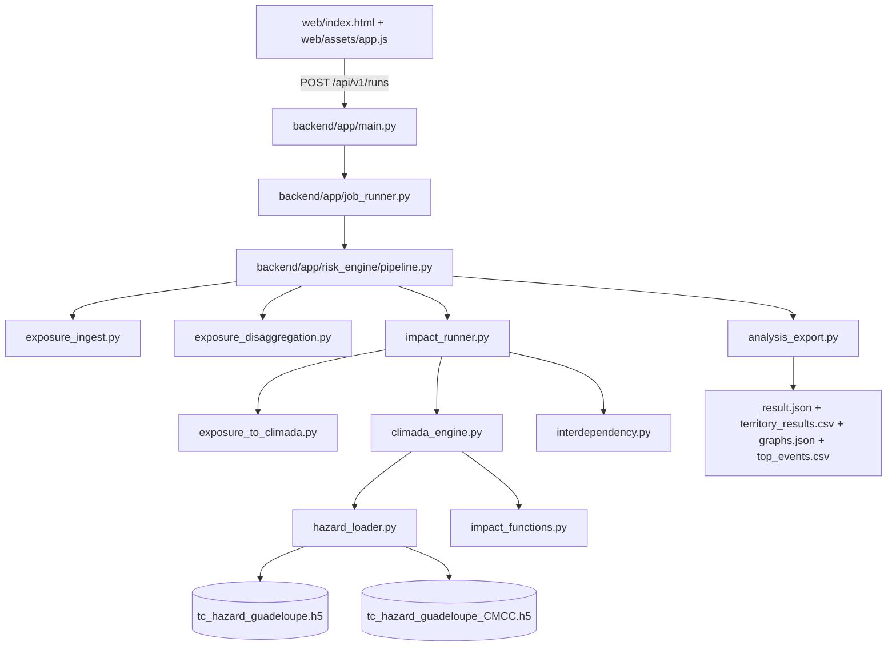

# Detailed Note - Cyclone Risk Computational Backend (CLIMADA)

## 1) Objective
This note explains:
- how the backend computes STORM and STORM_CMCC impacts with CLIMADA,
- how electricity -> water dependency is applied (conservative post-processing),
- which fields are produced in the final JSON payload,
- how Python modules interact.

The default engine is now the **full CLIMADA path** (`engine=climada_with_interdependency_v1`).
The deterministic fallback still exists, but only when explicitly enabled (`SIB_RISK_IMPACT_ENGINE_MODE=fallback`) or when `SIB_RISK_ALLOW_CLIMADA_FALLBACK=true`.

---

## 2) Architecture and Computation Flow



### Module roles
- `exposure_ingest.py`: normalizes user exposures (CSV/XLSX/GeoJSON/GPKG/drawn input).
- `exposure_disaggregation.py`: computes geometric summary metrics (also used to drive sampling).
- `exposure_to_climada.py`: converts geometries to CLIMADA points (metric CRS -> WGS84), preserving total value.
- `climada_engine.py`: loads STORM/STORM_CMCC hazards, runs CLIMADA `ImpactCalc`, extracts direct EAI / events / PML / TVaR.
- `interdependency.py`: applies electricity->water propagation and computes `health`.
- `impact_runner.py`: orchestrates everything and produces `territory_results`, `portfolio_results`, `graphs`, `notes`, and `meta.modeling`.
- `analysis_export.py`: assembles API payload and exports CSV/JSON artifacts.

---

## 3) Exposure Inputs and Normalization

The backend accepts:
- `input_mode=file`: CSV, XLSX, GeoJSON, GPKG,
- `input_mode=drawn_geojson`: user-drawn exposures.

Supported categories:
- `habitation`
- `ouvrage_eau`
- `ouvrage_electrique`

Main aliases:
- `electric`, `electricity`, `power` -> `ouvrage_electrique`
- `water`, `water_network` -> `ouvrage_eau`

---

## 4) Exposure -> CLIMADA Conversion

File: `backend/app/risk_engine/exposure_to_climada.py`

Principle:
1. each geometry is converted to a shapely object,
2. projected to a metric CRS (`SIB_RISK_CLIMADA_METRIC_CRS`, default `EPSG:3857`),
3. sampled into points:
   - point/multipoint: existing points,
   - line/multiline: interpolation using `sampling_spacing_m`,
   - polygon/multipolygon: internal grid sampling (with cap),
4. reprojected to WGS84,
5. asset value is split across sampled points.

Runtime parameters:
- `sampling_spacing_m` (from run payload),
- `SIB_RISK_CLIMADA_MAX_POINTS_PER_FEATURE` (default `300`) to control CPU/memory cost.

Business mapping preserved per point:
- `feature_id`, `territory_id`, `infra_class`, `asset_type`, `exposure_category`.

---

## 5) CLIMADA Direct Impact Computation

File: `backend/app/risk_engine/climada_engine.py`

### Steps
1. load hazards through `hazard_loader.py`:
   - STORM: `tc_hazard_guadeloupe.h5`
   - STORM_CMCC: `tc_hazard_guadeloupe_CMCC.h5`
2. normalize frequency:
   - `hazard.frequency = hazard.frequency / storm_years` (`storm_years=10000` by default)
3. build tropical cyclone impact function (Eberenz 2021) via `impact_functions.py`
4. run CLIMADA:
   - `ImpactCalc(exposures, impfset, hazard).impact(...)`

### Direct outputs per hazard
- `eai_direct_by_point` (direct EAI per exposure point),
- `max_loss_by_point` (max event loss per exposure point),
- `at_event_loss` (portfolio loss per event),
- `aai_agg_eur`,
- `max_event_loss_eur`,
- `pml_eur` for RP 10/20/50/100/200,
- `tvar_95_eur`,
- `top_events` (top N, default 20).

---

## 6) Four-State Business Rules + Health

### 6.1 States S0/S1/S2/S3
S0 Operational, S1 Degraded, S2 Critical, S3 Out of service.

Direct damage ratio:

```text
DR_max = max_event_loss_asset / value_asset
```

Classification:
- `S0`: `DR_max < 0.05`
- `S1`: `0.05 <= DR_max < 0.15`
- `S2`: `0.15 <= DR_max < 0.35`
- `S3`: `DR_max >= 0.35`

### 6.2 `health`

```text
health = 1 - (0.3*L_S1 + 0.7*L_S2 + 1.0*L_S3) / L_total
```

With:
- `L_total`: total weight (here: sum of asset/point values for the component),
- `L_S1`, `L_S2`, `L_S3`: weight in each state.

Important:
- in the CLIMADA backend engine (default mode), `L_*` is **not** a geometric length in km;
- the weight is re-aggregated **economic value** (`value_eur`) by state.

The `health` formula is computed for all components present in `component_health` (electricity, water, housing, etc.).
However, dependency propagation uses **only** electrical health to adjust water assets.

### 6.3 Direct answer: "how is length in each state computed?"

In the main API backend (`interdependency.py`), this is not a physical length but a value-based weight:

1. Each asset is sampled into `n` points (for lines: target spacing `sampling_spacing_m`, typically 100 m):

```text
n_line = min(max_points_per_feature, ceil(length_m / spacing_m) + 1)
```

2. Asset value is split uniformly:

```text
value_point = value_feature / n
```

3. Health buckets are aggregated by state:

```text
L_total = sum(value_point)
L_S1 = sum(value_point of points in S1)
L_S2 = sum(value_point of points in S2)
L_S3 = sum(value_point of points in S3)
```

So, in the API backend:
- `L_*` is exposed-value mass by state (not km).
- if `value = length_km * cost_per_km` for a linear class, `L_*` remains proportional to length, but the unit remains value weight.

Fallback mode note (`impact_runner.py`):
- this logic exists and can run (`SIB_RISK_IMPACT_ENGINE_MODE=fallback` or fallback after CLIMADA failure when allowed);
- it is not the nominal production path;
- in that mode, `_feature_weight` may use km length for lines, with conventional weights `1` (points) and `3` (polygons).

### 6.4 Annex - impacted length after disaggregation (outside main API engine)

This method is not used in the main API backend; it is an annex method for study tables/maps/scripts.

Principle:
1. compute `len_km(feature)` for each line,
2. distribute `len_point = len_km(feature) / n_points_feature`,
3. sum `len_point` by state to obtain `L_km_S0..S3`.

Practical equivalent already used in `scripts/build_guadeloupe_page1_data.py`:

```text
weights_km(point) = value_point / value_per_km(linear_class)
```

Then:

```text
L_km_Sj = sum(weights_km(point) in state Sj)
```

This conversion must remain limited to linear classes and exclude point-like assets (PR/STEP/AEP facilities).

---

## 7) Electricity -> Water Propagation (Conservative Post-Processing)

File: `backend/app/risk_engine/interdependency.py`

Conservative assumption:
- **all water assets depend on electricity**.

### 7.1 How the "electric part feeding water" is currently determined

The current model does not yet use an explicit electrical topology graph (source substation -> feeder -> pump/water facility).
Dependency is therefore computed using a robust and traceable spatial rule:

1. Exposure is sampled into points (lines/polygons -> points).
2. Each point is assigned to a **territory cell** (`territory_id`) based on coordinates:
   - function `_territory_for_coords(...)` in `exposure_to_climada.py`,
   - fixed `0.2 deg` grid (`TERRITORY_GRID_DEG = 0.2`).
3. For a given hazard (STORM or STORM_CMCC), direct electrical point states are computed first (`S0..S3`).
4. `health_elec` is computed by territory with:
   - `health = 1 - (0.3*L_S1 + 0.7*L_S2 + 1.0*L_S3)/L_total`
5. Each water point uses the electrical health of its territory:
   - if the territory has no electrical points, use the nearest electrical territory health;
   - last resort (no electrical territory available): global fallback.
6. This electrical health is converted to a dependency state (`S0..S3`) and applied to water points:
   - final water state = `max(direct_water_state, electric_dependency_state)`,
   - indirect loss uplift: `S0:+0%`, `S1:+10%`, `S2:+25%`, `S3:+45%`.

Important conclusion:
- currently, dependency is **spatial grid-based** (local grid then nearest electrical grid), not yet electrical-topological (no explicit pump->feeder attachment from source data).
- this is intentionally conservative to avoid underestimating water losses.

Algorithm:
1. compute `health_elec(territory, hazard)` from electrical assets,
2. convert to dependency state:
   - `health < 0.75` -> at least `S1`
   - `health < 0.55` -> at least `S2`
   - `health < 0.35` -> `S3`
3. for water assets only, indirect EAI uplift:
   - `S0: +0%`, `S1: +10%`, `S2: +25%`, `S3: +45%`
4. for non-water assets (including electricity), `EAI_indirect = 0`.
5. per asset/point safeguard: `EAI_total <= exposure_eur`.

Formulas:

```text
if water_asset:
  EAI_indirect(i,h) = EAI_direct(i,h) * uplift(state_dep(t,h))
else:
  EAI_indirect(i,h) = 0

EAI_total(i,h) = min(exposure_eur(i), EAI_direct(i,h) + EAI_indirect(i,h))
```

### 7.2 Why state ratios can look very close (or identical) between STORM and STORM_CMCC

This is not necessarily a computation error. In current Guadeloupe/Martinique outputs:

1. States are discrete (4 classes) with fixed thresholds (`5%`, `15%`, `35%`).
   - if two hazards produce different damage ratios but on the same side of a threshold, the state remains identical.
2. In annual scenario mode, many assets stay below `5%` for both hazards:
   - result: `S0` for STORM and STORM_CMCC, therefore same state percentages.
3. In severe scenarios (RP1000, max event), many assets exceed `35%` for both hazards:
   - result: saturation in `S3`, therefore same state ratios.
4. For water assets, final state is also driven by electric dependency (`max(direct, dep)`):
   - when electrical health is already very low under both hazards, water ends up in the same final state even if euro losses differ.
5. State tables may be weighted by aggregate weights (often exposed value in backend API, or proxy length in some front scripts):
   - small local differences may not change aggregated distribution.

Verification point:
- differences are visible on some cases (for example RP100 for several electrical classes), and `damage_eur` differs between STORM and STORM_CMCC.
- so the engine does not "copy" outputs; the 4-state discretization can smooth the physical difference.

---

## 8) Territory and Portfolio Aggregation

### 8.1 Territories
The backend aggregates by territory cell (`territory_id`) and produces:
- `eai_storm_direct_eur`, `eai_storm_indirect_eur`, `eai_storm_eur`
- `eai_cmcc_direct_eur`, `eai_cmcc_indirect_eur`, `eai_cmcc_eur`
- `risk_index_storm`, `risk_index_cmcc`

`risk_index_*` is kept for frontend compatibility:

```text
risk_index = clamp((EAI_total / exposure_eur) * 1000, 0, 100)
```

Interpretation:
- relative unitless index (not an EUR loss, not a probability),
- `EAI_total / exposure_eur` measures annualized risk pressure normalized by exposure,
- the `*1000` factor improves UI readability,
- `clamp(0,100)` bounds the index to avoid extreme display values.

### 8.2 Portfolio
For each hazard:
- `eai_eur`, `aai_agg_eur`, `max_event_loss_eur`
- `eai_direct_eur`, `eai_indirect_eur`
- `pml_10_eur`, `pml_20_eur`, `pml_50_eur`, `pml_100_eur`, `pml_200_eur`
- `tvar_95_eur`

Other blocks:
- `portfolio_results.component_health`
- `portfolio_results.interdependency`
- `portfolio_results.event_summary` (`storm_top_events`, `storm_cmcc_top_events`)

Detailed meaning of portfolio variables:
- `eai_eur`: total mean annual loss (direct + indirect) for the portfolio.
- `aai_agg_eur`: same magnitude as `eai_eur` in current output payload (kept for compatibility).
- `eai_direct_eur`: hazard direct component.
- `eai_indirect_eur`: additional component caused by electricity -> water dependency.
- `max_event_loss_eur`: estimated worst-event portfolio loss for the hazard.
- `pml_10/20/50/100/200/1000_eur`: reference losses by return period.
- `tvar_95_eur`: mean loss in the distribution tail beyond the 95% quantile.
- `delta.eai_eur`: absolute difference STORM_CMCC - STORM.
- `delta.eai_pct`: relative STORM_CMCC vs STORM gap in percent.
- `component_health`: per-component health (includes `health`, `L_total`, `L_S1`, `L_S2`, `L_S3`, `asset_count`).
- `interdependency`: dependency assumption, state thresholds, uplift, electrical health resolution metrics.
- `event_summary`: most damaging event lists per hazard.

---

## 9) JSON Output Contract (Compatibility + Extensions)

The payload keeps the historical frontend structure:
- `meta`, `exposure_summary`, `territory_results`, `portfolio_results`, `graphs`, `notes`.

Current additive extensions:
- `meta.engine` identifies effective engine (`climada_with_interdependency_v1` or fallback).
- `meta.modeling` makes modeling choices explicit (storm_years, hazard_source, dependency_mode, scenario_mode, sampling, etc.).
- `asset_results` provides per-asset detail in addition to `territory_results`.
- `portfolio_results` exposes direct/indirect components and `component_health`, `interdependency`, `event_summary` blocks.

Compatibility policy:
- no schema break on major top-level keys;
- additions are mainly new fields to preserve existing frontend compatibility.

Downloadable artifacts:
- `territory_results.csv`: tabular export of territory results.
- `graphs.json`: backend graph series export.
- `top_events.csv`: dominant events export (if `event_summary` is present).

---

## 10) Backend Graphs (`graphs`)

The backend preserves the same frontend keys:
- `graphs.storm.wind_year_hist`
- `graphs.storm.wind_track_hist`
- `graphs.storm.annual_fec`
- `graphs.storm.lifetime_fec`
- same for `storm_cmcc`
- `graphs.comparison.side_by_side`

Values are now derived from CLIMADA losses (event distribution + PML), then adjusted by the electricity->water indirect factor.

---

## 11) Important Runtime Configuration

Environment variables:
- `SIB_RISK_IMPACT_ENGINE_MODE`: `climada` (default) or `fallback`
- `SIB_RISK_ALLOW_CLIMADA_FALLBACK`: `true/false`
- `SIB_RISK_CLIMADA_METRIC_CRS`: e.g., `EPSG:3857`
- `SIB_RISK_CLIMADA_MAX_POINTS_PER_FEATURE`: sampling cap
- `SIB_RISK_CLIMADA_TOP_EVENTS_COUNT`: number of exported top events

Health endpoint:
- `GET /api/v1/health` returns notably:
  - `climada_runtime_ready`
  - `impact_engine_mode`
  - `fallback_allowed`

---

## 12) Conservative Monetary Valuation (OFB)

Water network valuation is based on observed mean values per territory from the OFB cost comparator.
Electrical networks and AEP facilities (`ovrg_type`) remain unchanged.

| Territory | Asset type | Valuation rule | Initial retained value | New OFB value | Number of compared prices |
|---|---|---|---|---|---|
| Guadeloupe | AEP pipelines | EUR per km | 280,000 EUR/km | 776,386 EUR/km | 24 |
| Guadeloupe | EU pipelines | EUR per km | 340,000 EUR/km | 791,691 EUR/km | 10 |
| Guadeloupe | EU pumping stations (PR) | fixed value per unit | 900,000 EUR | 523,211 EUR | 6 |
| Guadeloupe | EU treatment plants (STEP) | fixed value per unit | 6,000,000 EUR | 7,777,800 EUR | 1 |
| Martinique | AEP pipelines | EUR per km | 280,000 EUR/km | 653,445 EUR/km | 16 |
| Martinique | EU pipelines | EUR per km | 340,000 EUR/km | 831,815 EUR/km | 6 |
| Martinique | EU pumping stations (PR) | fixed value per unit | 900,000 EUR | 44,257 EUR | 1 |
| Martinique | EU treatment plants (STEP) | fixed value per unit | 6,000,000 EUR | 7,923,344 EUR | 2 |
| Guadeloupe + Martinique | LV overhead electricity | EUR per km | 180,000 EUR/km | unchanged | n/a |
| Guadeloupe + Martinique | LV underground electricity | EUR per km | 320,000 EUR/km | unchanged | n/a |
| Guadeloupe + Martinique | MV overhead electricity | EUR per km | 260,000 EUR/km | unchanged | n/a |
| Guadeloupe + Martinique | MV underground electricity | EUR per km | 520,000 EUR/km | unchanged | n/a |
| Guadeloupe + Martinique | AEP facilities (`ovrg_type`) | fixed value by type | `TRAIT=3.5M`, `STPMP=1.2M`, `CAP=1.0M`, `CUV=0.5M`, others=`0.8M` EUR | unchanged | n/a |

Technical details:
- linear assets: `value_eur = max(5000, length_km * cost_per_km)`
- point facilities: fixed value by facility type.

---

## 13) Guadeloupe Data Preparation Scripts

- `scripts/build_guadeloupe_complete_analysis.py`
  - builds the full water+electricity reference and runs backend computation.
- `scripts/build_guadeloupe_wind_maps.py`
  - computes STORM/STORM_CMCC mean wind maps over 10,000 years.
- `scripts/build_guadeloupe_water_infra_map.py`
  - builds the web layer for all water infrastructures.
- `scripts/rebuild_tc_hazard_na.py`
  - rebuilds STORM/STORM_CMCC TC hazards (NA basin) using Guadeloupe centroids.

---

## 14) Visual Update Note for NA Maps (2026-03-11)

A visual update was applied to NA hazard map rendering to remove visual banding artifacts (white lines / minimal grid cells visible) in cartographic exports and web overlays.

Scope of the update:
- visual nearest-neighbor fill for empty cells during rendering (`scripts/build_na_wind_leaflet_overlays.py`), limited to a local grid-cell distance to avoid covering out-of-data areas,
- new NA static export script (`scripts/render_na_wind_static_maps.py`) producing 6 maps without basemap and 6 maps with alpha50 basemap.

Important:
- this update is strictly **visual**;
- no change is applied to the CLIMADA impact computation pipeline;
- no change in hazard files used for computation (`*.h5`) nor in impact outputs (`portfolio_results`, `territory_results`).

---

## 15) Known Limits

- Electricity->water propagation is conservative and not based on an explicit electrical topology graph (source substation -> equipment).
- Indirect coupling is applied as a direct-EAI multiplier (no multi-step dynamic per-event simulation yet).
- The per-geometry point cap (`max_points_per_feature`) is required to control computational cost.

---

## 16) Full STORM Sources

- STORM present climate (all basins):
  https://data.4tu.nl/articles/dataset/STORM_IBTrACS_present_climate_synthetic_tropical_cyclone_tracks/12706085
- STORM CMCC:
  https://data.4tu.nl/datasets/98900e17-8e01-4d70-b3b6-ca1a1da2f194/2
