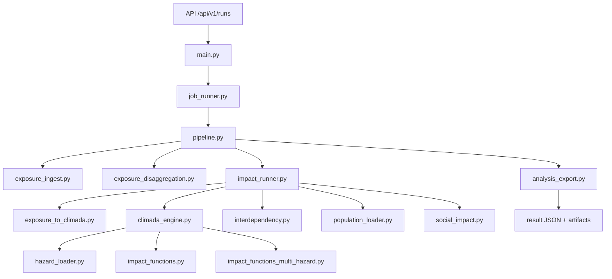

# Detailed Note - SIB Physical Risk Backend (CLIMADA + Interdependency)

Last updated: **2026-04-22**

## 1) Objective
This note documents the current computational backend used for SIB physical-risk runs on Guadeloupe and Martinique.

It explains:
- end-to-end architecture and execution flow,
- direct impacts from STORM/STORM_CMCC hazards,
- multi-hazard components (`wind`, `rain`, `surge`) in the CLIMADA path,
- conservative electricity -> water interdependency,
- social impact enrichment from population rasters,
- explicit fallback behavior and known limits.

Default engine:
- `engine=climada_with_interdependency_v1`
- fallback exists (`engine=fallback_with_interdependency`) and is controlled by runtime settings.

## 2) Architecture and Flow



## 3) API Surface (Current)
Key endpoints:
- `GET /api/v1/health`
- `GET /api/v1/hazard/coverage`
- `GET /api/v1/vulnerability/curves`
- `POST /api/v1/runs`
- `GET /api/v1/runs/search`
- `GET /api/v1/runs/recent`
- `GET /api/v1/runs/{job_id}`
- `GET /api/v1/runs/{job_id}/result`
- `GET /api/v1/runs/{job_id}/artifacts/{name}`

`/api/v1/vulnerability/curves` currently exposes:
- TC curves for `wind`,
- D2-driven multi-hazard curves for `rain`/`surge`,
- landslide payload for `landslide`.

## 4) Exposure Inputs and Normalization
Accepted modes:
- uploaded files (`CSV`, `XLSX`, `GeoJSON`, `GPKG`),
- `drawn_geojson` FeatureCollection.

Supported categories:
- `habitation`
- `ouvrage_eau`
- `ouvrage_electrique`

Normalization and validation occur in `exposure_ingest.py`.
Sampling/disaggregation controls are passed through run parameters and settings.

## 5) Hazard Sources and Selection
Primary source policy:
- dynamic STORM/STORM_CMCC from parquet datasets when available,
- optional fallback to precomputed HDF5 hazards.

Core controls (via settings/env):
- `SIB_RISK_HAZARD_PREFER_DYNAMIC_FROM_PARQUET`
- `SIB_RISK_HAZARD_FALLBACK_TO_PRECOMPUTED`
- `SIB_RISK_STORM_PARQUET_PATH`
- `SIB_RISK_STORM_CMCC_PARQUET_PATH`
- `SIB_RISK_HAZARD_STORM_PATH`
- `SIB_RISK_HAZARD_STORM_CMCC_PATH`

Frequency normalization is applied with `storm_years` (default `10000`).

## 6) Vulnerability and Multi-Hazard Components
### 6.1 Wind
`impact_functions.py` provides the tropical cyclone curve profile used in the default CLIMADA run.

### 6.2 Rain + Surge
`impact_functions_multi_hazard.py` builds impact functions from the D2 workbook and maps asset types to curve codes.

Operational component set in CLIMADA path:
- `wind` (TC)
- `rain` (TCRain proxy)
- `surge` (TCSurgeBathtub)

Component status is tracked in modeling metadata; strict/degraded behavior depends on `climada_strict_required_components`.

### 6.3 Landslide
`impact_functions_landslide.py` and `landslide_engine.py` provide a dedicated landslide path used by specialized scripts/analyses.
This is not the default production path of `/api/v1/runs`.

## 7) Direct Impacts and Interdependency
### 7.1 Direct impacts
`climada_engine.py` computes direct losses and metrics per hazard:
- `aai_agg_eur` / direct EAI
- `max_event_loss_eur`
- `pml_*`
- `tvar_95_eur`
- top events
- optional component-level (`wind/rain/surge`) breakdown

### 7.2 State model and health
State buckets use damage-ratio thresholds:
- `S0`: `< 0.05`
- `S1`: `[0.05, 0.15)`
- `S2`: `[0.15, 0.35)`
- `S3`: `>= 0.35`

Health formula:
```text
health = 1 - (0.3*L_S1 + 0.7*L_S2 + 1.0*L_S3) / L_total
```
In current backend aggregation, `L_*` is value-weighted mass (not literal infrastructure length).

### 7.3 Electricity -> water coupling
`interdependency.py` applies conservative post-processing:
- all water assets depend on electricity,
- electrical health lookup order: local territory -> nearest electrical territory -> global fallback,
- water indirect uplift by dependency state:
  - `S0:+0%`, `S1:+10%`, `S2:+25%`, `S3:+45%`
- cap enforced: `EAI_total <= exposure_eur`.

## 8) Social Impact Metrics
When population data is available (`population_loader.py`):
- territory population totals are added,
- per-territory social metrics are computed from network states (`social_impact.py`),
- portfolio social summaries are produced by hazard.

If population rasters are unavailable, social blocks are omitted or empty without blocking core risk results.

## 9) Aggregation and Output Contract
Main payload blocks:
- `meta`
- `exposure_summary`
- `territory_results`
- `asset_results`
- `portfolio_results`
- `matching_qa`
- `graphs`
- `notes`

Additive metadata currently includes:
- `meta.engine`
- `meta.hazard_components`
- `meta.modeling` (hazard source, component statuses, dependency settings, sampling settings, etc.)

Artifact exports include:
- `territory_results.csv`
- `graphs.json`
- `top_events.csv` (when available)

## 10) Runtime Configuration Controls
Main toggles:
- `SIB_RISK_IMPACT_ENGINE_MODE=climada|fallback`
- `SIB_RISK_ALLOW_CLIMADA_FALLBACK=true|false`
- `SIB_RISK_CLIMADA_MAX_POINTS_PER_FEATURE`
- `SIB_RISK_CLIMADA_TOP_EVENTS_COUNT`
- `SIB_RISK_MULTI_HAZARD_ENABLED`
- `SIB_RISK_HAZARD_RAIN_MODEL`
- `SIB_RISK_HAZARD_SURGE_TOPO_PATH`
- `SIB_RISK_D2_FLOOD_CURVE_FILE`
- `SIB_RISK_POPULATION_DATA_DIR`

## 11) Fallback Behavior (Explicit)
There are two fallback layers:

1. Hazard-source fallback:
- dynamic parquet preferred,
- optional fallback to precomputed HDF5 hazards.

2. Engine fallback:
- CLIMADA path attempted by default,
- deterministic fallback engine only if explicitly requested (`impact_engine_mode=fallback`) or if CLIMADA fails and `allow_climada_fallback=true`.

This behavior is explicit in `impact_runner.py` and reflected in `meta.engine` + `meta.modeling`.

## 12) Scripted End-to-End Runs
For full Guadeloupe+Martinique rerun without deployment:
```bash
python3 scripts/run_complete_analysis.py --territories both --no-deploy
```

This runner integrates scenario support (`sensitivity_scenarios.py`) and rebuilds case-study frontend artifacts.

## 13) Known Limits and Current Debt
Methodological limits:
- dependency is conservative and grid-based (not full electrical topology graph),
- indirect coupling is multiplier-based (not dynamic event-by-event propagation),
- sampling caps are a deliberate compute tradeoff.

Code-quality caveat as of **2026-04-22**:
- `scripts/audit_quick_checks.sh` currently fails due to `ruff` findings (33 issues).
- This does not invalidate the computational rerun path but must be treated as technical debt in expert review.

## 14) Data References
STORM source references:
- Present climate synthetic tracks: https://data.4tu.nl/articles/dataset/STORM_IBTrACS_present_climate_synthetic_tropical_cyclone_tracks/12706085
- CMCC projection dataset: https://data.4tu.nl/datasets/98900e17-8e01-4d70-b3b6-ca1a1da2f194/2
