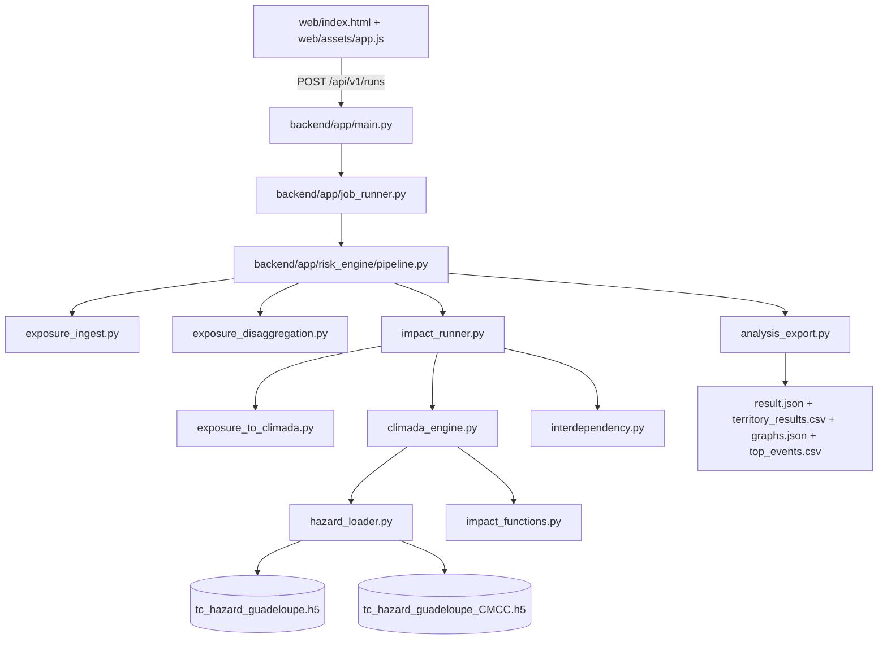

# Note detaillee - Backend calculatoire des risques cycloniques (CLIMADA)

## 1) Objectif
Cette note explique:
- comment le backend calcule les impacts STORM et STORM_CMCC avec CLIMADA,
- comment la dependance electricite -> eau est appliquee (post-traitement prudent),
- quels champs sont produits dans le JSON final,
- comment les fichiers Python interagissent.

Le moteur par defaut est maintenant **CLIMADA complet** (`engine=climada_with_interdependency_v1`).
Le fallback deterministic existe encore, mais uniquement en mode explicitement active (`SIB_RISK_IMPACT_ENGINE_MODE=fallback`) ou si `SIB_RISK_ALLOW_CLIMADA_FALLBACK=true`.

---

## 2) Architecture et flux de calcul



### Role des modules
- `exposure_ingest.py`: normalise les expositions utilisateur (CSV/XLSX/GeoJSON/GPKG/dessin).
- `exposure_disaggregation.py`: calcule un resume geometrique (utilise aussi pour pilotage du sampling).
- `exposure_to_climada.py`: convertit les geometries en points CLIMADA (CRS metrique -> WGS84), conserve la valeur totale.
- `climada_engine.py`: charge hazards STORM/STORM_CMCC, applique ImpactCalc CLIMADA, extrait EAI direct / evenements / PML / TVaR.
- `interdependency.py`: applique la propagation elec->eau et calcule la sante `health`.
- `impact_runner.py`: orchestre le tout, produit `territory_results`, `portfolio_results`, `graphs`, `notes`, `meta.modeling`.
- `analysis_export.py`: assemble le payload API et exporte les artefacts CSV/JSON.

---

## 3) Entrees et normalisation des expositions

Le backend accepte:
- `input_mode=file`: CSV, XLSX, GeoJSON, GPKG,
- `input_mode=drawn_geojson`: expositions dessinees.

Categories supportees:
- `habitation`
- `ouvrage_eau`
- `ouvrage_electrique`

Aliases principaux:
- `electric`, `electricity`, `power` -> `ouvrage_electrique`
- `water`, `water_network` -> `ouvrage_eau`

---

## 4) Conversion exposition -> CLIMADA

Fichier: `backend/app/risk_engine/exposure_to_climada.py`

Principe:
1. chaque geometrie est convertie en objet shapely,
2. projection en CRS metrique (`SIB_RISK_CLIMADA_METRIC_CRS`, defaut `EPSG:3857`),
3. echantillonnage en points:
   - point/multipoint: points existants,
   - ligne/multiligne: interpolation selon `sampling_spacing_m`,
   - polygone/multipolygone: grille interne (avec cap),
4. reprojection WGS84,
5. repartition de la valeur de l’actif sur les points echantillonnes.

Parametres runtime:
- `sampling_spacing_m` (depuis le run),
- `SIB_RISK_CLIMADA_MAX_POINTS_PER_FEATURE` (defaut `300`) pour controler cout CPU/memoire.

Le mapping metier est conserve par point:
- `feature_id`, `territory_id`, `infra_class`, `asset_type`, `exposure_category`.

---

## 5) Calcul d’impact direct CLIMADA

Fichier: `backend/app/risk_engine/climada_engine.py`

### Etapes
1. chargement des hazards via `hazard_loader.py`:
   - STORM: `tc_hazard_guadeloupe.h5`
   - STORM_CMCC: `tc_hazard_guadeloupe_CMCC.h5`
2. normalisation de frequence:
   - `hazard.frequency = hazard.frequency / storm_years` (`storm_years=10000` par defaut)
3. creation fonction d’impact tropical cyclone (Eberenz 2021) via `impact_functions.py`
4. calcul CLIMADA:
   - `ImpactCalc(exposures, impfset, hazard).impact(...)`

### Sorties directes par alea
- `eai_direct_by_point` (EAI direct par point d’exposition),
- `max_loss_by_point` (perte max evenementielle par point),
- `at_event_loss` (perte portfolio par evenement),
- `aai_agg_eur`,
- `max_event_loss_eur`,
- `pml_eur` pour RP 10/20/50/100/200,
- `tvar_95_eur`,
- `top_events` (top N, defaut 20).

---

## 6) Regles metier 4 etats + health

### 6.1 Etats S0/S1/S2/S3
S0 Opérationnel, S1 Dégradé, S2 Critique, S3 Hors service

Le ratio de dommage direct est:

```text
DR_max = max_event_loss_asset / value_asset
```

Classification:
- `S0`: `DR_max < 0.05`
- `S1`: `0.05 <= DR_max < 0.15`
- `S2`: `0.15 <= DR_max < 0.35`
- `S3`: `DR_max >= 0.35`

### 6.2 Sante `health`

```text
health = 1 - (0.3*L_S1 + 0.7*L_S2 + 1.0*L_S3) / L_total
```

Avec:
- `L_total`: poids total (ici somme des valeurs des actifs/points du composant),
- `L_S1`, `L_S2`, `L_S3`: poids dans chaque etat.

---

## 7) Propagation elec -> eau (post-traitement prudent)

Fichier: `backend/app/risk_engine/interdependency.py`

Hypothese prudente:
- **tous les actifs eau sont dependants de l’electricite**.

### 7.1 Comment la "partie elec qui alimente la partie eau" est decidee actuellement

Le modele actuel n'utilise pas encore un graphe electrique explicite (poste source -> depart -> pompe/ouvrage eau).
La dependance est donc calculee avec une regle spatiale robuste et traçable:

1. L'exposition est echantillonnee en points (lignes/polygones -> points).
2. Chaque point est affecte a une **maille territoriale** (`territory_id`) via ses coordonnees:
   - fonction ` _territory_for_coords(...) ` dans `exposure_to_climada.py`,
   - maille fixe de `0.2 deg` (`TERRITORY_GRID_DEG = 0.2`).
3. Pour un alea donne (STORM ou STORM_CMCC), on calcule d'abord les etats directs des points elec (`S0..S3`).
4. On calcule ensuite `health_elec` par maille territoriale avec la formule:
   - `health = 1 - (0.3*L_S1 + 0.7*L_S2 + 1.0*L_S3)/L_total`
5. Chaque point eau prend la sante elec de sa maille:
   - si la maille n'a pas de points elec, fallback sur la sante elec globale.
6. Cette sante elec est transformee en etat de dependance (`S0..S3`), puis appliquee aux points eau:
   - etat final eau = `max(etat_direct_eau, etat_dependance_elec)`,
   - uplift de perte indirecte: `S0:+0%`, `S1:+10%`, `S2:+25%`, `S3:+45%`.

Conclusion importante:
- aujourd'hui, la dependance est **locale par maille spatiale**, pas encore "electrique topologique" (pas de rattachement pompe->depart HTA/BT identifie dans les donnees source).
- c'est volontairement prudent pour eviter de sous-estimer les pertes eau.

Algorithme:
1. calcul de `health_elec(territoire, alea)` a partir des actifs electriques,
2. conversion en etat de dependance:
   - `health < 0.75` -> au moins `S1`
   - `health < 0.55` -> au moins `S2`
   - `health < 0.35` -> `S3`
3. pour les actifs eau, uplift d’EAI indirect:
   - `S0: +0%`, `S1: +10%`, `S2: +25%`, `S3: +45%`

Formules:

```text
EAI_indirect(i,h) = EAI_direct(i,h) * uplift(state_dep(t,h))
EAI_total(i,h) = EAI_direct(i,h) + EAI_indirect(i,h)
```

### 7.2 Pourquoi on peut observer des ratios d'etats tres proches (voire identiques) entre STORM et STORM_CMCC

Ce n'est pas forcement une erreur de calcul. Dans les sorties actuelles Guadeloupe/Martinique:

1. Les etats sont discrets (4 classes) avec seuils fixes (`5%`, `15%`, `35%`).
   - si deux aleas donnent des ratios de dommage differents mais du meme cote d'un seuil, l'etat reste identique.
2. En scenario annuel, beaucoup d'actifs restent sous `5%` pour les deux aleas:
   - resultat: `S0` pour STORM et STORM_CMCC, donc memes pourcentages d'etats.
3. En scenarios severes (RP1000, evenement max), beaucoup d'actifs depassent `35%` dans les deux aleas:
   - resultat: saturation en `S3`, donc memes ratios d'etats.
4. Pour l'eau, l'etat final est aussi pilote par la dependance elec (`max(direct, dep)`):
   - quand la sante elec est deja tres basse dans les deux aleas, l'eau passe dans le meme etat final meme si les montants en euros restent differents.
5. Les tableaux d'etats sont ponderes par longueur (poids lineaires):
   - de petites differences locales peuvent ne pas changer la repartition agregée.

Point de verification:
- on observe bien des differences sur certains cas (ex. scenario RP100 pour plusieurs classes elec), et les `damage_eur` STORM vs STORM_CMCC sont differents.
- donc le moteur ne "copie" pas les resultats, mais la discretisation en 4 classes peut lisser la difference physique.

---

## 8) Aggregation territoriale et portfolio

### 8.1 Territoires
Le backend agrège par maille territoriale (`territory_id`) et produit:
- `eai_storm_direct_eur`, `eai_storm_indirect_eur`, `eai_storm_eur`
- `eai_cmcc_direct_eur`, `eai_cmcc_indirect_eur`, `eai_cmcc_eur`
- `risk_index_storm`, `risk_index_cmcc`

`risk_index_*` est conserve pour compatibilite front:

```text
risk_index = clamp((EAI_total / exposure_eur) * 1000, 0, 100)
```

### 8.2 Portfolio
Pour chaque alea:
- `eai_eur`, `aai_agg_eur`, `max_event_loss_eur`
- `eai_direct_eur`, `eai_indirect_eur`
- `pml_10_eur`, `pml_20_eur`, `pml_50_eur`, `pml_100_eur`, `pml_200_eur`
- `tvar_95_eur`

Autres blocs:
- `portfolio_results.component_health`
- `portfolio_results.interdependency`
- `portfolio_results.event_summary` (`storm_top_events`, `storm_cmcc_top_events`)

---

## 9) Contrat de sortie JSON (compatibilite + extensions)

Compatibilite legacy conservee:
- `meta`, `exposure_summary`, `territory_results`, `portfolio_results`, `graphs`, `notes`.

Ajouts:
- `meta.engine = "climada_with_interdependency_v1"`
- `meta.modeling = {storm_years, frequency_normalized, dependency_mode, scenario_mode, ...}`
- nouveaux champs directs/indirects/PML/TVaR/top events.

Artefacts telechargeables:
- `territory_results.csv`
- `graphs.json`
- `top_events.csv` (si `event_summary` disponible)

---

## 10) Graphiques backend (`graphs`)

Le backend conserve les memes cles pour le front:
- `graphs.storm.wind_year_hist`
- `graphs.storm.wind_track_hist`
- `graphs.storm.annual_fec`
- `graphs.storm.lifetime_fec`
- idem `storm_cmcc`
- `graphs.comparison.side_by_side`

Les valeurs sont maintenant derivees des pertes CLIMADA (distribution evenementielle + PML), puis ajustees par le facteur indirect elec->eau.

---

## 11) Parametrage runtime important

Variables d’environnement:
- `SIB_RISK_IMPACT_ENGINE_MODE`: `climada` (defaut) ou `fallback`
- `SIB_RISK_ALLOW_CLIMADA_FALLBACK`: `true/false`
- `SIB_RISK_CLIMADA_METRIC_CRS`: ex. `EPSG:3857`
- `SIB_RISK_CLIMADA_MAX_POINTS_PER_FEATURE`: cap sampling
- `SIB_RISK_CLIMADA_TOP_EVENTS_COUNT`: top evenements exportes

Endpoint sante:
- `GET /api/v1/health` retourne notamment:
  - `climada_runtime_ready`
  - `impact_engine_mode`
  - `fallback_allowed`

---

## 12) Valorisation monetaire prudente (OFB)

La valeur des reseaux eau est basee sur la moyenne observee par territoire dans le comparateur de couts OFB.
Les reseaux electriques et les ouvrages AEP (`ovrg_type`) sont conserves inchanges.

| Territoire | Type d'actif | Regle de valorisation | Valeur initiale retenue | Nouvelle valeur OFB | Nombre de prix compares |
|---|---|---|---|---|---|
| Guadeloupe | AEP canalisations | EUR par km | 280 000 EUR/km | 776 386 EUR/km | 24 |
| Guadeloupe | EU canalisations | EUR par km | 340 000 EUR/km | 791 691 EUR/km | 10 |
| Guadeloupe | EU postes de refoulement (PR) | valeur fixe par unite | 900 000 EUR | 523 211 EUR | 6 |
| Guadeloupe | EU stations d'epuration (STEP) | valeur fixe par unite | 6 000 000 EUR | 7 777 800 EUR | 1 |
| Martinique | AEP canalisations | EUR par km | 280 000 EUR/km | 653 445 EUR/km | 16 |
| Martinique | EU canalisations | EUR par km | 340 000 EUR/km | 831 815 EUR/km | 6 |
| Martinique | EU postes de refoulement (PR) | valeur fixe par unite | 900 000 EUR | 44 257 EUR | 1 |
| Martinique | EU stations d'epuration (STEP) | valeur fixe par unite | 6 000 000 EUR | 7 923 344 EUR | 2 |
| Guadeloupe + Martinique | Elec BT aerien | EUR par km | 180 000 EUR/km | inchange | n/a |
| Guadeloupe + Martinique | Elec BT souterrain | EUR par km | 320 000 EUR/km | inchange | n/a |
| Guadeloupe + Martinique | Elec HTA aerien | EUR par km | 260 000 EUR/km | inchange | n/a |
| Guadeloupe + Martinique | Elec HTA souterrain | EUR par km | 520 000 EUR/km | inchange | n/a |
| Guadeloupe + Martinique | AEP ouvrages (`ovrg_type`) | valeur fixe par type | `TRAIT=3.5M`, `STPMP=1.2M`, `CAP=1.0M`, `CUV=0.5M`, autres=`0.8M` EUR | inchange | n/a |

Details techniques:
- lineaires: `value_eur = max(5000, longueur_km * cout_km)`
- ouvrages ponctuels: valeur fixe par type d’ouvrage.

---

## 13) Scripts de preparation des donnees Guadeloupe

- `scripts/build_guadeloupe_complete_analysis.py`
  - construit la reference complete eau+electricite et lance le backend de calcul.
- `scripts/build_guadeloupe_wind_maps.py`
  - calcule les cartes vent moyen STORM/STORM_CMCC sur 10 000 ans.
- `scripts/build_guadeloupe_water_infra_map.py`
  - construit la couche web de toutes les infrastructures d’eau.
- `scripts/rebuild_tc_hazard_na.py`
  - reconstruit les hazards TC STORM/STORM_CMCC (bassin NA) avec les centroids Guadeloupe.

---

## 14) Limites connues

- La propagation elec->eau est prudente et non basee sur un graphe electrique explicite poste-source -> equipement.
- Le couplage indirect est applique en multiplicateur d’EAI direct (pas encore simulation dynamique multi-etapes par evenement).
- Le cap de points par geometrie (`max_points_per_feature`) est necessaire pour maitriser le cout calculatoire.

---

## 15) Sources STORM completes

- STORM present climate (all basins):  
  https://data.4tu.nl/articles/dataset/STORM_IBTrACS_present_climate_synthetic_tropical_cyclone_tracks/12706085
- STORM CMCC:  
  https://data.4tu.nl/datasets/98900e17-8e01-4d70-b3b6-ca1a1da2f194/2
