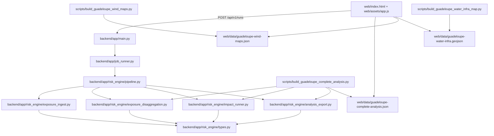
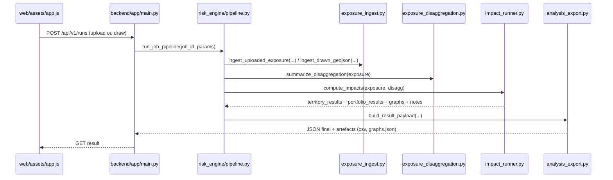

# Note detaillee - Backend calculatoire des risques cycloniques

## 1) Objectif de cette note
Cette note explique en detail:
- la logique de calcul actuellement active cote backend,
- la regle de decision en 4 etats (S0/S1/S2/S3),
- la propagation des dysfonctionnements electricite -> eau,
- l'architecture logicielle entre les fichiers Python/JSON du projet,
- le role des scripts de preparation des donnees Guadeloupe.

Le moteur en production est un **fallback deterministic** (pas encore la chaine CLIMADA finale), mais il integre deja les regles metier demandees.

---

## 2) Vue d'ensemble de l'architecture (fichiers et interactions)



### Fichiers principaux
- API entree: `backend/app/main.py`
- Orchestration run: `backend/app/risk_engine/pipeline.py`
- Ingestion/normalisation expositions: `backend/app/risk_engine/exposure_ingest.py`
- Desagregation geometrique: `backend/app/risk_engine/exposure_disaggregation.py`
- Calcul impacts + dependances: `backend/app/risk_engine/impact_runner.py`
- Construction payload resultat: `backend/app/risk_engine/analysis_export.py`
- Types structures communes: `backend/app/risk_engine/types.py`

### Fichiers de donnees de reference Guadeloupe
- Resultat complet eau+electricite: `web/data/guadeloupe-complete-analysis.json`
- Cartes vent moyen STORM/STORM_CMCC: `web/data/guadeloupe-wind-maps.json`
- Carte de toutes les infrastructures eau: `web/data/guadeloupe-water-infra.geojson`

---

## 3) Entree utilisateur et normalisation des expositions

Le backend accepte:
- upload (`input_mode=file`) en CSV, XLSX, GeoJSON, GPKG,
- dessin carte (`input_mode=drawn_geojson`).

### Parametres categories
Dans `main.py`, le formulaire accepte:
- `exposure_category_field` (nom de colonne source),
- `default_exposure_category` (valeur par defaut).

Dans `exposure_ingest.py`, les categories sont normalisees vers:
- `habitation`
- `ouvrage_eau`
- `ouvrage_electrique`

Alias geres (exemples):
- `electric`, `electricity`, `power` -> `ouvrage_electrique`
- `water`, `water_network` -> `ouvrage_eau`

---

## 4) Regle d'etat a 4 niveaux

Chaque composant recoit un ratio de dommage direct (entre 0 et 1), puis est classe:
- `S0` operationnel: dommage < 0.05
- `S1` degrade: 0.05 <= dommage < 0.15
- `S2` critique: 0.15 <= dommage < 0.35
- `S3` hors service: dommage >= 0.35

Implementation: `impact_runner.py`, fonction `_state_from_damage_ratio`.

---

## 5) Calcul du dommage direct

Le fallback calcule un dommage direct par actif selon:
1. une base liee a la complexite geometrique (nombre de points desagreges),
2. un facteur de classe d'infrastructure (aerien, souterrain, eau reseau, eau ouvrage, habitation),
3. un facteur hazard (`storm_cmcc` > `storm`),
4. un facteur spatial deterministic (hash stable par actif).

Forme simplifiee:

```text
damage_direct = clamp(base_damage * class_factor * hazard_factor * spatial_factor, 0, 0.95)
```

Extrait:
```python
def _direct_damage_ratio(feature, hazard_key, base_damage):
    infra_class = _infer_infra_class(feature)
    class_factor = DIRECT_CLASS_FACTOR.get(infra_class, 1.0)
    hazard_factor = CMCC_DAMAGE_SCALER if hazard_key == "storm_cmcc" else 1.0
    spatial_factor = _stable_factor(f"{feature.feature_id}|{hazard_key}|{infra_class}", 0.82, 1.18)
    return _clamp(base_damage * class_factor * hazard_factor * spatial_factor, 0.0, 0.95)
```

---

## 6) Health des composants (formule demandee)

La sante d'un composant est calculee a partir des longueurs/poids en etats S1/S2/S3:

```text
health = 1 - (0.3*L_S1 + 0.7*L_S2 + 1.0*L_S3) / L_total
```

Ou:
- `L_total`: poids total du composant (longueur pour lineaire si geometrique dispo, sinon poids unitaire),
- `L_S1`: poids en etat degrade,
- `L_S2`: poids en etat critique,
- `L_S3`: poids hors service.

Interpretation:
- proche de `1.0` -> composant robuste/fonctionnel,
- proche de `0.0` -> composant tres degrade/hors service.

Ces valeurs sont exportees dans:
- `portfolio_results.component_health.<hazard>.<classe>`

---

## 7) Propagation des dysfonctionnements elec -> eau

Hypothese prudente retenue:
- tous les actifs d'eau sont dependants de l'electricite.

Algorithme:
1. calculer health electrique par territoire (et global),
2. convertir cette health en etat de dependance:
   - health < 0.75 -> au moins `S1`
   - health < 0.55 -> au moins `S2`
   - health < 0.35 -> `S3`
3. pour chaque actif eau:
   - `final_state = max(direct_state, dependency_state)`
   - dommage final releve a un plancher lie a l'etat de dependance
4. convertir en EAI.

Extrait:
```python
if infra_class in {"eau_reseau", "eau_ouvrage"}:
    elec_health = elec_health_by_territory[hazard].get(territory_id, elec_health_global[hazard])
    dependency_state = _dependency_state_from_elec_health(elec_health)
    if STATE_ORDER[dependency_state] > STATE_ORDER[direct_state]:
        final_state = dependency_state
    final_damage = max(final_damage, STATE_DAMAGE_FLOOR[dependency_state])
```

---

## 8) Passage au cout annuel (EAI)

Une fois le dommage final obtenu, le moteur calcule la perte annuelle attendue:

```text
EAI_asset = exposure_value_eur * final_damage * annualization_factor(hazard)
```

Avec:
- `annualization_factor(storm)=0.22`
- `annualization_factor(storm_cmcc)=0.25`

Agrégation:
- somme par territoire -> `territory_results`
- somme globale -> `portfolio_results`

---

## 9) Pipeline de calcul run API



---

## 10) Scripts de preparation Guadeloupe

### a) `scripts/build_guadeloupe_complete_analysis.py`
Role:
- lit les jeux infrastructures eau + electricite dans `/home/ubuntu/uploads/...`,
- applique des hypotheses de valorisation prudentes (EUR/km, EUR/ouvrage),
- execute le meme moteur de risque backend,
- produit la reference de premiere page:
  - `web/data/guadeloupe-complete-analysis.json`

### b) `scripts/build_guadeloupe_wind_maps.py`
Role:
- lit les catalogues STORM/CMCC NA sur 10 000 ans,
- calcule la vitesse moyenne max du vent par maille geographique autour de la Guadeloupe,
- produit:
  - `web/data/guadeloupe-wind-maps.json`

### c) `scripts/build_guadeloupe_water_infra_map.py`
Role:
- lit l'ensemble des couches eau (AEP + EU),
- simplifie legerement les geometries lineaires pour le web,
- produit:
  - `web/data/guadeloupe-water-infra.geojson`

### d) Hypotheses de valorisation monetaire (cas Guadeloupe)

Les valeurs monetaires ci-dessous sont des **hypotheses prudentes** utilisees pour le cas de reference Guadeloupe dans:
- `scripts/build_guadeloupe_complete_analysis.py`

Elles n'ont pas ete fournies par un barème officiel unique dans les donnees sources; elles servent donc de base de calcul coherente en attendant des couts metier valides par type d'actif.

| Type d'actif | Regle de valorisation | Valeur retenue |
|---|---|---|
| Elec BT aerien | EUR par km | 180 000 EUR/km |
| Elec BT souterrain | EUR par km | 320 000 EUR/km |
| Elec HTA aerien | EUR par km | 260 000 EUR/km |
| Elec HTA souterrain | EUR par km | 520 000 EUR/km |
| AEP canalisations | EUR par km | 280 000 EUR/km |
| EU canalisations | EUR par km | 340 000 EUR/km |
| EU postes de refoulement (PR) | valeur fixe par unite | 900 000 EUR |
| EU stations d'epuration (STEP) | valeur fixe par unite | 6 000 000 EUR |
| AEP ouvrages (`ovrg_type`) | valeur fixe par type | `TRAIT=3.5M`, `STPMP=1.2M`, `CAP=1.0M`, `CUV=0.5M`, autres=`0.8M` EUR |

Details techniques:
- pour les lineaires: `value_eur = max(5000, longueur_km * cout_km)`
- pour les ouvrages points: valeur fixe par actif/type.

---

## 11) Ce que la page web affiche

La premiere page presente:
1. titre et description de l'exercice,
2. carte STORM des vents moyens tempete,
3. carte STORM CMCC des vents moyens tempete,
4. carte de toutes les infrastructures d'eau,
5. indicateurs de couts et dommages (KPIs, carte risques territoriaux, tableaux, courbes).

En plus, un bloc "Ajout d'expositions utilisateur" permet:
- upload de donnees propres,
- dessin d'expositions avec categorie (`habitation`, `ouvrage_eau`, `ouvrage_electrique`).

---

## 12) Limites et prochaine etape

Limites actuelles du fallback:
- dommages directs deterministic (pas encore simulation CLIMADA complete),
- dependance elec->eau sans graphe physique detaille poste source -> pompe.

Prochaine etape recommandee:
- brancher `compute_impacts()` sur la chaine CLIMADA de production avec les memes structures de sortie
  pour conserver la compatibilite front/API.

### 12.1) Blocages techniques concrets pour brancher CLIMADA complet
Le lien CLIMADA est possible, mais il manque encore une couche d'integration applicative:
1. **Construction Exposures CLIMADA**:
   - convertir proprement les geometries lineaires/polygones des reseaux en points d'exposition CLIMADA avec valeurs coherentes,
   - maintenir la trace `asset_id -> territoire -> categorie` pour la restitution web.
2. **Chargement Hazard CLIMADA dans le pipeline runtime**:
   - connecter `hazard_loader.py` dans `compute_impacts()` (et plus seulement dans l'architecture cible),
   - garantir la normalisation frequence et l'usage STORM / STORM_CMCC dans le meme schema de sortie.
3. **Couche Impact Function + calcul**:
   - utiliser l'impact function TC (Eberenz 2021) directement sur les expositions converties,
   - calculer EAI / AAI / losses par alea sans casser les objets JSON attendus par le front.
4. **Reaggregation metier**:
   - reconstituer les resultats par territoire et par classe d'infrastructure (eau/elec/habitation),
   - conserver les champs supplementaires: `component_health`, `interdependency`.
5. **Validation de non-regression**:
   - comparer fallback vs CLIMADA sur cas tests,
   - verifier coherence unites, ordres de grandeur, et temps de calcul pour les gros jeux reseaux.

Conclusion: ce n'est pas un blocage de donnees; c'est un blocage d'integration logicielle entre la couche CLIMADA et le contrat API/web deja en place.

---

## 13) Sources STORM completes a citer

- STORM present climate (all basins):
  https://data.4tu.nl/articles/dataset/STORM_IBTrACS_present_climate_synthetic_tropical_cyclone_tracks/12706085
- STORM CMCC:
  https://data.4tu.nl/datasets/98900e17-8e01-4d70-b3b6-ca1a1da2f194/2
