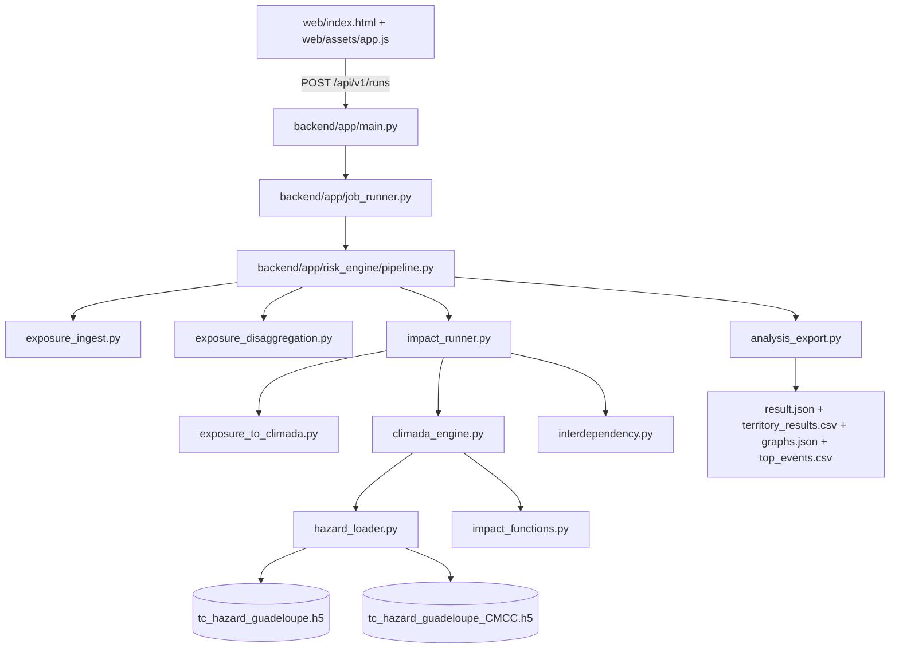

# Note detaillee - Backend calculatoire des risques cycloniques (CLIMADA)

Derniere mise a jour: 2026-04-29

## 1) Objectif
Cette note explique:
- comment le backend calcule les impacts STORM et STORM_CMCC avec CLIMADA,
- comment la dependance electricite -> eau est appliquee (post-traitement prudent),
- quels champs sont produits dans le JSON final,
- comment les fichiers Python interagissent.

Le moteur par defaut est maintenant **CLIMADA complet** (`engine=climada_with_interdependency_v1`).
La voie scientifique de production est maintenant **fail-closed**:
- `compute_impacts(...)` rejette `impact_engine_mode=fallback`
- `compute_impacts(...)` rejette `SIB_RISK_ALLOW_CLIMADA_FALLBACK=true`
- `compute_impacts(...)` rejette le fallback HDF5 pre-calcule

Des helpers legacy de fallback peuvent encore exister dans le repo pour audit / historique, mais ils ne constituent plus un mode de production autorise.

---

## 2) Architecture et flux de calcul



### Role des modules
- `exposure_ingest.py`: normalise les expositions utilisateur (CSV/XLSX/GeoJSON/GPKG/dessin).
- `exposure_disaggregation.py`: calcule un resume geometrique (utilise aussi pour pilotage du sampling).
- `exposure_to_climada.py`: convertit les geometries en points CLIMADA (CRS metrique -> WGS84), conserve la valeur totale.
- `climada_engine.py`: charge hazards STORM/STORM_CMCC, applique ImpactCalc CLIMADA, extrait EAI direct / evenements / PML / TVaR.
- `interdependency.py`: applique la propagation elec->eau et calcule la sante `health`.
- `impact_runner.py`: orchestre le tout, produit `territory_results`, `portfolio_results`, `graphs`, `notes`, `meta.modeling`.
- `analysis_export.py`: assemble le payload API et exporte les artefacts CSV/JSON.

### 2.1 Mailles spatiales utilisées par les briques principales

Le tableau ci-dessous recense les principales mailles spatiales et pas d'echantillonnage utilises par le code. Certaines lignes ne correspondent pas a une grille fixe, mais a une fenetre spatiale, a un pas d'echantillonnage ou a une resolution de publication.

| Nom element du code | Description rapide | Maille geographique | Notes |
|---|---|---|---|
| `exposure_to_climada.py` | Echantillonnage des geometries exposees en points CLIMADA et repartition de la valeur des actifs sur ces points. | Pas de grille fixe; `sampling_spacing_m` pilote l'echantillonnage des lignes/polygones. Regroupement territorial secondaire via `TERRITORY_GRID_DEG = 0.2°`. | Une maille plus fine est possible pour des etudes locales, mais elle augmente surtout le nombre de points, donc le temps CPU/RAM. |
| `hazard_loader.py` | Chargement des tracks dans une fenetre spatiale autour des expositions et cap sur le nombre de tracks gardes. | Fenetre spatiale avec `DEFAULT_SPATIAL_PADDING_DEG = 4.0°`; petit-cas avec `DEFAULT_SMALL_SAMPLE_GRID_STEP_DEG = 0.01°`. | Resserer la fenetre accelere le calcul, mais augmente le risque de rater des tracks proches de la zone etudiee. |
| `climada_engine.py` / `TropCyclone`, `TCRain`, `TCSurgeBathtub` | Construction des hazards CLIMADA vent, pluie et submersion a partir des tracks. | Pas de grille fixe propre au moteur; la resolution est celle des centroides/hazards en entree. | Une maille plus fine depend surtout de la source des tracks et du nombre de centroides disponibles. |
| `impact_runner.py` | Agregation de `health` et de la dependance elec -> eau par zone territoriale. | `TERRITORY_GRID_DEG = 0.2°`. | Une maille plus fine est faisable pour une etude locale, mais la dependance devient plus bruiante et plus couteuse. |
| `mean_wind_mps`, `rp50_wind_mps`, `rp100_wind_mps`, `event_max_wind_mps` | Statistiques de cellule pour la couche aléas vent; la meme logique existe pour la pluie (`*_rain_mmph`) et la submersion (`*_surge_m`). | Même maille que la couche d'aléa correspondante: `0.02°` sur Guadeloupe/Martinique, `0.05°` sur les cartes bassin NA/SI. | Ces valeurs sont des statistiques de restitution sur cellule, pas des mailles physiques supplémentaires. Une maille plus fine est possible si l'on accepte plus de calcul et des sorties plus volumineuses. |
| `scripts/build_guadeloupe_wind_maps.py` | Couche aléas vent pour Guadeloupe/Martinique. | Grille de publication `cell_deg = 0.02°`; submersion interne sur `surge_native_cell_deg = 0.01°`. | On dispose déjà d'une sous-maille plus fine pour le surge. Descendre encore est possible, mais le gain devient marginal et le cout monte vite. |
| `scripts/build_guadeloupe_wind_maps.py` | Couche aléas pluie pour Guadeloupe/Martinique. | Grille de publication `0.02°`, même maille que le vent. | Une maille plus fine peut aider si l'on veut zoomer un littoral ou un relief local, mais le bénéfice dépend surtout de la qualité du modèle pluie. |
| `scripts/build_guadeloupe_wind_maps.py` | Couche aléas surge pour Guadeloupe/Martinique. | Calcul natif sur `0.01°`, puis réagrégation en `0.02°` pour l'affichage web. | C'est déjà la maille la plus fine du pipeline courant. La descendre plus bas n'apporterait qu'un gain limité sans nouvelle validation topo/bathy. |
| `scripts/build_basin_wind_maps.py` | Cartes bassin NA/SI (`mean`, `rp50`, `rp100`, `event_max`) pour STORM et STORM_CMCC. | Grille `0.05°`. | Une maille plus fine est possible, mais elle augmente rapidement le volume de sortie et le temps de traitement sur de grands bassins. |
| `scripts/build_na_wind_leaflet_overlays.py` / `scripts/build_basin_wind_leaflet_overlays.py` | Rasterisation et rendu Leaflet des couches d'aléa a partir des cellules calculees. | Même maille que le JSON source (`0.02°` ou `0.05°` selon le jeu). | Une maille plus fine ici ne change pas la physique; elle améliore surtout la lisibilité visuelle, au prix d'un rendu plus lourd. |
| `scripts/build_case_study_multi_hazard_proxy.py` / `scripts/build_guadeloupe_page1_data.py` | Tables et graphiques de restitution page 1/page 2 construits a partir des cellules d'aléa et du proxy multi-aléas. | Pas de nouvelle maille physique; agrégation sur la grille d'aléa correspondante. | On ne gagne en précision que si les grilles amont sont elles-mêmes plus fines et validées. |

### 2.2 Tracks dynamiques: plafond de catalogue et cap conseille

Les chiffres ci-dessous viennent du chargement dynamique STORM/STORM_CMCC sur la fenetre de publication page 5, c'est-à-dire la bbox NA avec le padding spatial du loader. Ils donnent le nombre de tracks réellement disponibles avant tout cap `dynamic_max_tracks`.

| Territoire | STORM tracks disponibles | STORM_CMCC tracks disponibles | Plafond reel de sélection | Commentaire |
|---|---:|---:|---:|---|
| Guadeloupe | 23 151 | 24 208 | 23 151 / 24 208 | Au-dessus de ces valeurs, le code ne peut plus enrichir le catalogue car la source est déjà entièrement selectionnee sur cette fenetre. |
| Martinique | 21 288 | 22 292 | 21 288 / 22 292 | Meme lecture: le cap utile est le nombre de tracks effectivement présents dans la zone. |

| Contexte | `dynamic_max_tracks` conseille | Temps de run indicatif | Pourquoi ce choix |
|---|---:|---:|---|
| Runs fixes de demonstration Guadeloupe / Martinique | 1 200 | ~10-20 min par territoire | Compromis deja utilise dans les pages de demo (`page1/page2`) pour garder des RP50/RP100 plus stables sans exploser le temps de calcul. |
| Runs "light" page 5 pour les utilisateurs | 300 | ~3-6 min par territoire | Compromis interactif deja retenu pour la carte d'aléas; assez léger pour l'UX, mais encore sous-échantillonné pour la queue des extremums. |

En pratique:
- `300` est le bon ordre de grandeur pour une visualisation rapide et fluide.
- `1 200` est le bon ordre de grandeur pour les runs de demonstration fixes.
- Si l'on cherche une convergence plus forte des RP50/RP100, il faut monter encore le cap, mais le temps de calcul augmente vite et le gain devient de plus en plus marginal.

---

## 3) Exposition

Le backend accepte:
- `input_mode=file`: CSV, XLSX, GeoJSON, GPKG,
- `input_mode=drawn_geojson`: expositions dessinees.

Categories supportees:
- `habitation`
- `ouvrage_eau`
- `ouvrage_electrique`

Aliases principaux:
- `electric`, `electricity`, `power` -> `ouvrage_electrique`
- `water`, `water_network` -> `ouvrage_eau`

---

### 3.1 Conversion exposition -> CLIMADA

Fichier: `backend/app/risk_engine/exposure_to_climada.py`

Principe:
1. chaque geometrie est convertie en objet shapely,
2. projection en CRS metrique (`SIB_RISK_CLIMADA_METRIC_CRS`, defaut `EPSG:3857`),
3. echantillonnage en points:
   - point/multipoint: points existants,
   - ligne/multiligne: interpolation selon `sampling_spacing_m`,
   - polygone/multipolygone: grille interne (avec cap),
4. reprojection WGS84,
5. repartition de la valeur de l’actif sur les points echantillonnes.

Parametres runtime:
- `sampling_spacing_m` (depuis le run),
- `SIB_RISK_CLIMADA_MAX_POINTS_PER_FEATURE` (defaut `300`) pour controler cout CPU/memoire.

Le mapping metier est conserve par point:
- `feature_id`, `territory_id`, `infra_class`, `asset_type`, `exposure_category`.

---

## 4) Aléas

Fichier: `backend/app/risk_engine/climada_engine.py`

### 4.1 Construction des aléas et calcul direct CLIMADA
1. chargement des hazards via `hazard_loader.py`:
   - STORM: `tc_hazard_guadeloupe.h5`
   - STORM_CMCC: `tc_hazard_guadeloupe_CMCC.h5`
2. normalisation de frequence:
   - `hazard.frequency = hazard.frequency / storm_years` (`storm_years=10000` par defaut)
3. creation d'un profil multicourbe tropical cyclone via `impact_functions.py`:
   - courbe Eberenz Caraibes (`Eberenz_2021_TC`) conservee comme courbe par defaut,
   - courbes D2 (vulnerabilite uniquement) chargees depuis `data/tc_vulnerability_curves_sib_v1.json`,
   - mapping explicite `asset_type -> impf_TC` applique dans `exposure_to_climada.py`.
4. calcul CLIMADA:
   - `ImpactCalc(exposures, impfset, hazard).impact(save_mat=True, assign_centroids=False)`

### 4.2 Sorties directes par alea
- `eai_direct_by_point` (EAI direct par point d’exposition),
- `max_loss_by_point` (perte max evenementielle par point, extraite de `imp_mat.max(axis=0)`),
- `at_event_loss` (perte portfolio par evenement),
- `aai_agg_eur`,
- `max_event_loss_eur` (champ public historique, desormais interprete comme une perte de queue de type percentile 99),
- `raw_max_event_loss_eur` (max evenement brut conserve pour QA / audit),
- `pml_eur` pour RP 10/20/50/100/200,
- `tvar_95_eur`,
- `top_events` (top N, defaut 20).

### 4.3 Tableau des courbes de vulnerabilite appliquees (vent + pluie/submersion)

| Type d'infrastructure (asset_type) | Courbe vent (windstorm) | Courbe pluie/submersion (depth) | Provenance geographique principale | Justification (resume) |
|---|---|---|---|---|
| `elec_bt_aerien` | `W3.10` | `F6.2` | Mexique + D2 inondation | Courbe reseau electrique aerien |
| `elec_hta_aerien` | `W3.14` | `F6.2` | Mexique + D2 inondation | Courbe reseau electrique aerien HTA |
| `elec_bt_souterrain` | `W16.1` | `F6.1` | Global + D2 inondation | Option prudente non nulle pour reseau enterre |
| `elec_hta_souterrain` | `W16.1` | `F6.1` | Global + D2 inondation | Option prudente non nulle pour reseau enterre |
| `eau_aep_cana` | `W16.1` | `F19.3` | Global + D2 inondation | Reseau eau lineaire |
| `eau_eu_cana` | `W19.1` | `F19.3` | Global + D2 inondation | Reseau EU lineaire |
| `eau_eu_pr` | `EBERENZ_2021_TC` | `F20.3` | Caraibes + D2 inondation | Choix utilisateur conserve pour PR |
| `eau_eu_step` | `W21.2` | `F18.4` | Philippines + D2 inondation | Ouvrage eau exterieur sensible |
| `eau_aep_ouvrage_trait` | `W21.2` | `F14.4` | Philippines + D2 inondation | Ouvrage eau exterieur sensible |
| `eau_aep_ouvrage_stpmp` | `W21.4` | `F17.4` | Philippines + D2 inondation | Ouvrage eau exterieur sensible |
| `eau_aep_ouvrage_cap` | `W21.10` | `F15.1` | Philippines + D2 inondation | Ouvrage eau exterieur sensible |
| `eau_aep_ouvrage_cuv` | `W21.5` | `F13.1` | Philippines + D2 inondation | Ouvrage eau exterieur sensible |
| `eau_aep_ouvrage_ouveb` | `W21.5` | `F13.1` | Philippines + D2 inondation | Ouvrage eau exterieur sensible |
| `eau_aep_ouvrage_na` | `W21.5` | `F14.4` | Philippines + D2 inondation | Valeur de repli ouvrage AEP |

Notes:
- courbe depth de repli globale: `F17.5`,
- mise a jour specifique: `eau_aep_cana` utilise desormais `F19.3` pour les futurs reruns pluie / submersion cotiere,
- l'endpoint `GET /api/v1/vulnerability/curves` expose le profil actif pour audit/visualisation admin.

---

## 5) Impacts

### 5.1 Regles metier 4 etats + health

### 5.1.1 Etats S0/S1/S2/S3
S0 Opérationnel, S1 Dégradé, S2 Critique, S3 Hors service

Le ratio de dommage direct est:

```text
DR_max = max_event_loss_asset / value_asset
```

Classification:
- `S0`: `DR_max < 0.05`
- `S1`: `0.05 <= DR_max < 0.15`
- `S2`: `0.15 <= DR_max < 0.35`
- `S3`: `DR_max >= 0.35`

### 5.1.2 Sante `health`

```text
health = 1 - (0.3*L_S1 + 0.7*L_S2 + 1.0*L_S3) / L_total
```

Avec:
- `L_total`: poids total (ici somme des valeurs des actifs/points du composant),
- `L_S1`, `L_S2`, `L_S3`: poids dans chaque etat.

Important:
- dans le moteur backend CLIMADA (mode par defaut), `L_*` n'est pas une longueur geometrique en km;
- le poids est la **valeur economique** (`value_eur`) re-agrégée par etat.

La formule `health` est calculee pour tous les composants presents dans `component_health` (elec, eau, habitation, etc.).
En revanche, la propagation de dependance utilise **uniquement** la sante electrique pour ajuster les actifs eau.

### 5.1.3 Reponse directe: "comment est calculee la longueur dans chaque etat ?"

Dans le backend API principal (`interdependency.py`), ce n'est pas une longueur physique mais un poids de valeur:

1. Chaque actif est echantillonne en `n` points (si ligne: pas cible `sampling_spacing_m`, typiquement 100 m):

```text
n_ligne = min(max_points_per_feature, ceil(longueur_m / spacing_m) + 1)
```
2. La valeur de l'actif est repartie uniformement:

```text
value_point = value_feature / n
```
3. Les buckets de sante sont agreges par etat:

```text
L_total = somme(value_point)
L_S1 = somme(value_point des points en S1)
L_S2 = somme(value_point des points en S2)
L_S3 = somme(value_point des points en S3)
```

Donc, dans l'API backend:
- `L_*` est une masse de valeur exposee par etat (pas un km).
- si `value = longueur_km * cout_km` pour une classe lineaire, `L_*` reste proportionnel a la longueur, mais l'unite reste un poids de valeur.

Note historique sur le fallback (`impact_runner.py`):
- des helpers legacy existent encore pour audit / historique;
- ils ne sont plus un mode de calcul scientifique autorise par l'entree de production `compute_impacts(...)`;
- la documentation ci-dessus decrit donc la voie CLIMADA de production et non un mode degrade executable.

### 5.1.4 Annexe - longueur impactee apres desagregation (hors moteur API principal)

Cette methode n'est pas utilisee dans le backend API principal; c'est une methode annexe pour des tableaux cartes/scripts d'etude.

Principe:
1. calculer `len_km(feature)` pour chaque ligne;
2. distribuer `len_point = len_km(feature) / n_points_feature`;
3. sommer `len_point` par etat pour obtenir `L_km_S0..S3`.

Equivalent pratique deja utilise dans `scripts/build_guadeloupe_page1_data.py`:

```text
weights_km(point) = value_point / value_per_km(classe_lineaire)
```

Puis:

```text
L_km_Sj = somme(weights_km(point) des points en Sj)
```

Cette conversion doit rester reservee aux classes lineaires, et exclure les ouvrages ponctuels (PR/STEP/AEP ouvrages).

---

### 5.2 Propagation elec -> eau (post-traitement prudent)

Fichier: `backend/app/risk_engine/interdependency.py`

Hypothese prudente:
- **tous les actifs eau sont dependants de l’electricite**.

#### 5.2.1 Comment la "partie elec qui alimente la partie eau" est decidee actuellement

Le modele actuel n'utilise pas encore un graphe electrique explicite (poste source -> depart -> pompe/ouvrage eau).
La dependance est donc calculee avec une regle spatiale robuste et traçable:

1. L'exposition est echantillonnee en points (lignes/polygones -> points).
2. Chaque point est affecte a une **maille territoriale** (`territory_id`) via ses coordonnees:
   - fonction ` _territory_for_coords(...) ` dans `exposure_to_climada.py`,
   - maille fixe de `0.2 deg` (`TERRITORY_GRID_DEG = 0.2`).
3. Pour un alea donne (STORM ou STORM_CMCC), on calcule d'abord les etats directs des points elec (`S0..S3`).
4. On calcule ensuite `health_elec` par maille territoriale avec la formule:
   - `health = 1 - (0.3*L_S1 + 0.7*L_S2 + 1.0*L_S3)/L_total`
5. Chaque point eau prend la sante elec de sa maille:
   - si la maille n'a pas de points elec, on prend la sante de la maille electrique la plus proche;
   - et en dernier recours (aucune maille elec disponible), fallback global.
6. Cette sante elec est transformee en etat de dependance (`S0..S3`), puis appliquee aux points eau:
   - etat final eau = `max(etat_direct_eau, etat_dependance_elec)`,
   - uplift de perte indirecte: `S0:+0%`, `S1:+10%`, `S2:+25%`, `S3:+45%`.

Conclusion importante:
- aujourd'hui, la dependance est **spatiale par maille** (maille locale puis maille elec la plus proche), pas encore "electrique topologique" (pas de rattachement pompe->depart HTA/BT identifie dans les donnees source).
- c'est volontairement prudent pour eviter de sous-estimer les pertes eau.

Algorithme:
1. calcul de `health_elec(territoire, alea)` a partir des actifs electriques,
2. conversion en etat de dependance:
   - `health < 0.75` -> au moins `S1`
   - `health < 0.55` -> au moins `S2`
   - `health < 0.35` -> `S3`
3. pour les actifs eau uniquement, uplift d’EAI indirect:
   - `S0: +0%`, `S1: +10%`, `S2: +25%`, `S3: +45%`
4. pour les actifs non-eau (dont elec), `EAI_indirect = 0`.
5. garde-fou par actif/point: `EAI_total <= exposure_eur`.

Formules:

```text
si actif_eau:
  EAI_indirect(i,h) = EAI_direct(i,h) * uplift(state_dep(t,h))
sinon:
  EAI_indirect(i,h) = 0

EAI_total(i,h) = min(exposure_eur(i), EAI_direct(i,h) + EAI_indirect(i,h))
```

#### 5.2.2 Pourquoi on peut observer des ratios d'etats tres proches (voire identiques) entre STORM et STORM_CMCC

Ce n'est pas forcement une erreur de calcul. Dans les sorties actuelles Guadeloupe/Martinique:

1. Les etats sont discrets (4 classes) avec seuils fixes (`5%`, `15%`, `35%`).
   - si deux aleas donnent des ratios de dommage differents mais du meme cote d'un seuil, l'etat reste identique.
2. En scenario annuel, beaucoup d'actifs restent sous `5%` pour les deux aleas:
   - resultat: `S0` pour STORM et STORM_CMCC, donc memes pourcentages d'etats.
3. En scenarios severes (RP1000, evenement max), beaucoup d'actifs depassent `35%` dans les deux aleas:
   - resultat: saturation en `S3`, donc memes ratios d'etats.
4. Pour l'eau, l'etat final est aussi pilote par la dependance elec (`max(direct, dep)`):
   - quand la sante elec est deja tres basse dans les deux aleas, l'eau passe dans le meme etat final meme si les montants en euros restent differents.
5. Les tableaux d'etats peuvent etre ponderes par un poids agregé (souvent valeur exposee dans le backend API, ou longueur proxy dans certains scripts front):
   - de petites differences locales peuvent ne pas changer la repartition agregée.

Point de verification:
- on observe bien des differences sur certains cas (ex. scenario RP100 pour plusieurs classes elec), et les `damage_eur` STORM vs STORM_CMCC sont differents.
- donc le moteur ne "copie" pas les resultats, mais la discretisation en 4 classes peut lisser la difference physique.

---

### 5.3 Aggregation territoriale et portfolio

#### 5.3.1 Territoires
Le backend agrège par maille territoriale (`territory_id`) et produit:
- `eai_storm_direct_eur`, `eai_storm_indirect_eur`, `eai_storm_eur`
- `eai_cmcc_direct_eur`, `eai_cmcc_indirect_eur`, `eai_cmcc_eur`
- `risk_index_storm`, `risk_index_cmcc`

`risk_index_*` est conserve pour compatibilite front:

```text
risk_index = clamp((EAI_total / exposure_eur) * 1000, 0, 100)
```

Interpretation:
- c'est un indice relatif sans unite (pas une perte en euros, pas une probabilite);
- `EAI_total / exposure_eur` mesure la "pression de risque annualisee" rapportee a l'exposition;
- le facteur `*1000` augmente la lisibilite numerique pour l'UI;
- `clamp(0,100)` borne l'indice pour eviter des valeurs extrêmes en affichage.

#### 5.3.2 Portfolio
Pour chaque alea:
- `eai_eur`, `aai_agg_eur`, `percentile_99_loss_eur`
- `eai_direct_eur`, `eai_indirect_eur`
- `pml_10_eur`, `pml_20_eur`, `pml_50_eur`, `pml_100_eur`, `pml_200_eur`, `pml_1000_eur`
- `tvar_95_eur`

Autres blocs:
- `portfolio_results.component_health`
- `portfolio_results.interdependency`
- `portfolio_results.event_summary` (`storm_top_events`, `storm_cmcc_top_events`)

Signification detaillee des variables portfolio:
- `eai_eur`: perte annuelle moyenne totale (direct + indirect) du portefeuille.
- `aai_agg_eur`: meme ordre de grandeur que `eai_eur` dans le payload de sortie actuel (champ garde pour compatibilite).
- `eai_direct_eur`: part directe calculee par alea.
- `eai_indirect_eur`: part additionnelle due a la dependance elec -> eau.
- `percentile_99_loss_eur`: headline public de perte evenementielle de queue pour l'alea.
- `pml_10/20/50/100/200/1000_eur`: pertes de reference par periode de retour.
- pour les graphes de comparaison backend/front, la comparaison synthétique privilegie desormais `annual_eai` + `pml_1000`; `percentile_99_loss_eur` reste expose pour compatibilite, audit et diagnostics.
- `tvar_95_eur`: moyenne des pertes dans la queue de distribution au-dela du quantile 95%.
- `delta.eai_eur`: ecart absolu STORM_CMCC - STORM.
- `delta.eai_pct`: ecart relatif STORM_CMCC vs STORM en pourcentage.
- `component_health`: sante par composant (inclut `health`, `L_total`, `L_S1`, `L_S2`, `L_S3`, `asset_count`).
- `interdependency`: hypothese de dependance, seuils d'etat, uplift, metriques de resolution de sante elec.
- `event_summary`: liste des evenements les plus dommageables par alea.

Note compatibilite:
- certains helpers d'audit ou archives historiques peuvent encore exposer `max_event_loss_eur` comme alias du meme headline public
- le max brut monotone par evenement est conserve separement dans les metriques directes internes via `raw_max_event_loss_eur`

---

### 5.4 Contrat de sortie JSON (compatibilite + extensions)

Le payload conserve la structure historique pour le front:
- `meta`, `exposure_summary`, `territory_results`, `portfolio_results`, `graphs`, `notes`.

Extensions actuelles (additives):
- `meta.engine` identifie le moteur effectif (attendu en production: `climada_with_interdependency_v1`).
- `meta.modeling` explicite les choix de modelisation (storm_years, hazard_source, dependency_mode, scenario_mode, sampling, etc.).
- `asset_results` fournit le detail par actif en plus de `territory_results`.
- `portfolio_results` expose les composantes direct/indirect et les blocs `component_health`, `interdependency`, `event_summary`.

Politique de compatibilite:
- pas de rupture de schema sur les cles top-level principales;
- ajouts principalement en nouveaux champs, pour conserver la compatibilite front existante.

Artefacts telechargeables:
- `territory_results.csv`: export tabulaire des resultats territoriaux.
- `graphs.json`: export des series graphiques backend.
- `top_events.csv`: export des evenements dominants (si `event_summary` present).

---

### 5.5 Graphiques backend (`graphs`)

Le backend conserve les memes cles pour le front:
- `graphs.storm.wind_year_hist`
- `graphs.storm.wind_track_hist`
- `graphs.storm.annual_fec`
- `graphs.storm.lifetime_fec`
- idem `storm_cmcc`
- `graphs.comparison.side_by_side`

Les valeurs sont maintenant derivees des pertes CLIMADA (distribution evenementielle + PML), puis ajustees par le facteur indirect elec->eau.

Conventions actuelles de publication:
- `annual_fec` s'aligne sur la base de periodes de retour `10/20/50/100/200/1000` ans,
- `graphs.comparison.side_by_side` compare `annual_eai` et `pml_1000`,
- `percentile_99_loss_eur` reste disponible dans le payload portefeuille mais n'est plus la metrique privilegiee pour la vue de comparaison synthétique.

---

### 5.6 Parametrage runtime important

Variables d’environnement:
- `SIB_RISK_IMPACT_ENGINE_MODE`: `climada` (defaut) ou `auto`; `fallback` est rejete par l'entree de production
- `SIB_RISK_ALLOW_CLIMADA_FALLBACK`: doit rester `false` en production
- `SIB_RISK_HAZARD_FALLBACK_TO_PRECOMPUTED`: doit rester `false` en production scientifique
- `SIB_RISK_CLIMADA_METRIC_CRS`: ex. `EPSG:3857`
- `SIB_RISK_CLIMADA_MAX_POINTS_PER_FEATURE`: cap sampling
- `SIB_RISK_CLIMADA_TOP_EVENTS_COUNT`: top evenements exportes
- `SIB_RISK_STORM_CONVERT_10MIN_TO_1MIN`: conversion des vents soutenus STORM de la convention moyenne 10 minutes vers l'equivalent 1 minute (defaut: `true`)

Endpoint sante:
- `GET /api/v1/health` retourne un etat minimal de service (`status`, `app`, `now_utc`, `version`)
- les choix de modelisation et de garde-fous sont visibles dans les payloads de run (`meta`, `meta.modeling`), pas dans l'endpoint sante

---

## 6) Annexes et complements

### 6.1 Valorisation monetaire prudente (OFB)

La valeur des reseaux eau est basee sur la moyenne observee par territoire dans le comparateur de couts OFB.
Pour les reseaux electriques, les quatre classes BT/HTA aerien/souterrain utilisent des valeurs D3 (`Table_D3_Costs_V1.1.0`, ICF 2002).
Les ouvrages AEP (`ovrg_type`) restent inchanges.

| Territoire | Type d'actif | Regle de valorisation | Valeur initiale retenue | Nouvelle valeur | Provenance geographique / source | Nombre de prix compares |
|---|---|---|---|---|---|---|
| Guadeloupe | AEP canalisations | EUR par km | 280 000 EUR/km | 776 386 EUR/km | Guadeloupe, comparateur OFB | 24 |
| Guadeloupe | EU canalisations | EUR par km | 340 000 EUR/km | 791 691 EUR/km | Guadeloupe, comparateur OFB | 10 |
| Guadeloupe | EU postes de refoulement (PR) | valeur fixe par unite | 900 000 EUR | 523 211 EUR | Guadeloupe, comparateur OFB | 6 |
| Guadeloupe | EU stations d'epuration (STEP) | valeur fixe par unite | 6 000 000 EUR | 7 777 800 EUR | Guadeloupe, comparateur OFB | 1 |
| Martinique | AEP canalisations | EUR par km | 280 000 EUR/km | 653 445 EUR/km | Martinique, comparateur OFB | 16 |
| Martinique | EU canalisations | EUR par km | 340 000 EUR/km | 831 815 EUR/km | Martinique, comparateur OFB | 6 |
| Martinique | EU postes de refoulement (PR) | valeur fixe par unite | 900 000 EUR | 44 257 EUR | Martinique, comparateur OFB | 1 |
| Martinique | EU stations d'epuration (STEP) | valeur fixe par unite | 6 000 000 EUR | 7 923 344 EUR | Martinique, comparateur OFB | 2 |
| Guadeloupe + Martinique | Elec BT aerien | EUR par km | 180 000 EUR/km | 167 060 EUR/km | D3 (ICF 2002, EU + Norvege + Suisse), overhead power line single 220kV | n/a |
| Guadeloupe + Martinique | Elec BT souterrain | EUR par km | 320 000 EUR/km | 1 336 480 EUR/km | D3 (ICF 2002, EU + Norvege + Suisse), derive de 1 994,39 EUR/m * (167 060 / 249 299) * 1000 | n/a |
| Guadeloupe + Martinique | Elec HTA aerien | EUR par km | 260 000 EUR/km | 249 299 EUR/km | D3 (ICF 2002, EU + Norvege + Suisse), overhead power line single 380kV | n/a |
| Guadeloupe + Martinique | Elec HTA souterrain | EUR par km | 520 000 EUR/km | 1 994 390 EUR/km | D3 (ICF 2002, EU + Norvege + Suisse), 1 994,39 EUR/m * 1000 | n/a |
| Guadeloupe + Martinique | AEP ouvrages (`ovrg_type`) | valeur fixe par type | `TRAIT=3.5M`, `STPMP=1.2M`, `CAP=1.0M`, `CUV=0.5M`, autres=`0.8M` EUR | inchange | Hypothese interne SIB | n/a |

Details techniques:
- lineaires: `value_eur = max(5000, longueur_km * cout_km)`
- ouvrages ponctuels: valeur fixe par type d’ouvrage.

---

### 6.2 Scripts de preparation des donnees Guadeloupe

- `scripts/build_guadeloupe_complete_analysis.py`
  - construit la reference complete eau+electricite et lance le backend de calcul.
- `scripts/build_guadeloupe_wind_maps.py`
  - calcule les cartes d'aleas web Guadeloupe/Martinique:
    - vent natif CLIMADA via `TropCyclone.from_tracks(...)`,
    - pluie native CLIMADA via `TCRain.from_tracks(...)`,
    - submersion cotiere native CLIMADA via `TCSurgeBathtub.from_tc_winds(...)`,
    - clipping final par masque administratif ADM0.
- `scripts/build_guadeloupe_water_infra_map.py`
  - construit la couche web de toutes les infrastructures d’eau.
- `scripts/rebuild_tc_hazard_na.py`
  - reconstruit les hazards TC STORM/STORM_CMCC (bassin NA) avec les centroids Guadeloupe.

---

### 6.3 Note de mise a jour visuelle cartes NA (2026-03-11)

Une mise a jour a ete appliquee sur le rendu des cartes d'alea NA pour supprimer les bandes visuelles (lignes blanches / mailles minimales apparentes) dans les exports cartographiques et overlays web.

Portee de la mise a jour:
- remplissage visuel des mailles vides en mode `nearest` lors du rendu (`scripts/build_na_wind_leaflet_overlays.py`), limite a une distance locale de mailles pour eviter de recouvrir les zones hors donnees,
- nouveau script d'export statique NA (`scripts/render_na_wind_static_maps.py`) pour produire les 6 cartes sans basemap et les 6 cartes basemap alpha50.

Important:
- cette mise a jour est strictement **visuelle**;
- aucun changement n'est applique au pipeline de calcul d'impact CLIMADA;
- aucun changement des fichiers hazard utilises pour les calculs (`*.h5`) ni des resultats d'impact (`portfolio_results`, `territory_results`).

---

### 6.4 Limites connues

- La propagation elec->eau est prudente et non basee sur un graphe electrique explicite poste-source -> equipement.
- Le couplage indirect est applique en multiplicateur d’EAI direct (pas encore simulation dynamique multi-etapes par evenement).
- Le cap de points par geometrie (`max_points_per_feature`) est necessaire pour maitriser le cout calculatoire.

---

### 6.5 Sources STORM completes

- STORM present climate (all basins):  
  https://data.4tu.nl/articles/dataset/STORM_IBTrACS_present_climate_synthetic_tropical_cyclone_tracks/12706085
- STORM CMCC:  
  https://data.4tu.nl/datasets/98900e17-8e01-4d70-b3b6-ca1a1da2f194/2

---

### 6.6 Comparatif runs de reference (mise a jour du 18 mars 2026)

Runs relances:
- `guadeloupe-complete-analysis.json` (avant: 6 mars 2026, apres: 19 mars 2026),
- `martinique-complete-analysis.json` (avant: 6 mars 2026, apres: 19 mars 2026).

Constat backend:
- moteur avant/apres: `climada_with_interdependency_v1` (identique),
- courbe d'impact avant: `Eberenz_2021_TC`,
- courbe d'impact apres: `sib_tc_multicurve_v1`,
- points d'exposition inchanges (meme maillage): Guadeloupe `329 087`, Martinique `403 040`.

Comparatif portefeuille:

| Territoire | Indicateur | Avant | Apres | Delta | Delta % |
|---|---|---:|---:|---:|---:|
| Guadeloupe | Exposition totale (EUR) | 6 897 242 082.83 | 10 724 270 292.36 | +3 827 028 209.53 | +55.49% |
| Guadeloupe | EAI STORM (EUR) | 173 053 024.90 | 45 658 339.84 | -127 394 685.06 | -73.62% |
| Guadeloupe | EAI STORM_CMCC (EUR) | 168 786 513.42 | 45 000 203.36 | -123 786 310.06 | -73.34% |
| Guadeloupe | PML100 STORM (EUR) | 3 105 623 211.08 | 652 391 930.03 | -2 453 231 281.05 | -78.99% |
| Guadeloupe | PML100 STORM_CMCC (EUR) | 3 178 330 265.72 | 666 187 625.37 | -2 512 142 640.35 | -79.04% |
| Martinique | Exposition totale (EUR) | 6 920 334 413.21 | 9 700 592 279.76 | +2 780 257 866.55 | +40.18% |
| Martinique | EAI STORM (EUR) | 183 234 379.13 | 62 421 784.11 | -120 812 595.02 | -65.93% |
| Martinique | EAI STORM_CMCC (EUR) | 158 602 734.52 | 57 548 784.82 | -101 053 949.70 | -63.72% |
| Martinique | PML100 STORM (EUR) | 3 370 891 097.00 | 822 440 899.41 | -2 548 450 197.59 | -75.60% |
| Martinique | PML100 STORM_CMCC (EUR) | 3 047 373 432.97 | 763 538 222.03 | -2 283 835 210.94 | -74.94% |

Verification page Donnee utilisateur (`/api/v1/runs`):
- run test: `jr_20260318_000313_aeb0e3`,
- `meta.engine = climada_with_interdependency_v1`,
- `meta.impact_function = sib_tc_multicurve_v1`,
- `meta.modeling.impact_function_profile = sib_tc_multicurve_v1`.

---

### 6.7 Extension multi-aleas cycloniques (mise a jour du 20 mars 2026)

#### 6.7.1 Perimetre V1 implemente
Le moteur CLIMADA backend conserve les deux scenarios historiques:
- `storm`
- `storm_cmcc`

Chaque scenario peut maintenant agreger jusqu'a trois composantes d'alea direct:
- `wind` (TropCyclone, existant)
- `rain` (TCRain, modele `R-CLIPER`)
- `surge` (TCSurgeBathtub)

Le contrat top-level reste compatible (`storm` / `storm_cmcc` inchanges) et des champs additifs ont ete ajoutes pour la decomposition des composantes.

#### 6.7.2 Source de donnees TC et generation des composantes
Objectif retenu: generer pluie et submersion a partir des memes donnees cycloniques que le vent (STORM/STORM_CMCC).

Implementation:
1. si possible, construction dynamique des hazards a partir des datasets parquet STORM/STORM_CMCC,
2. generation du vent par `TropCyclone.from_tracks(...)`,
3. generation de la pluie par `TCRain.from_tracks(..., model="R-CLIPER")`,
4. generation de la submersion par `TCSurgeBathtub.from_tc_winds(wind_hazard, topo_path)`.

Important:
- la composante pluie necessite les tracks dynamiques;
- la production scientifique n'autorise plus de fallback HDF5 pre-calcule pour contourner cette contrainte;
- la submersion bathtub peut rester calculable via l'aléa vent + DEM.
- dans la chaine dynamique STORM/STORM_CMCC, les vents soutenus sont convertis de la convention moyenne 10 minutes vers l'equivalent 1 minute via le facteur `1 / 0.88`, afin d'aligner l'aléa vent sur la convention attendue par CLIMADA et par la courbe Eberenz.

En langage naturel, la chaine backend est la suivante:
- on part des points d'exposition effectivement echantillonnes par CLIMADA;
- on recupere uniquement les tracks STORM/STORM_CMCC utiles autour de ces points;
- ces tracks servent d'abord a produire un aléa vent `TropCyclone`;
- a partir de ce meme socle, on derive:
  - un champ de pluie `TCRain`,
  - une submersion cotiere `TCSurgeBathtub`.

Autrement dit, pluie et submersion ne sont pas lues depuis une source exogene independante: elles sont calculees a partir des memes cyclones synthetiques STORM que le vent.

Extrait du chargement dynamique STORM -> tracks -> vent:

```python
centroids = _build_centroids_from_points(coords)
tracks_storm = _get_or_build_tracks(...)
tracks_cmcc = _get_or_build_tracks(...)

storm = _build_hazard_from_tracks(tracks_storm, centroids)
storm_cmcc = _build_hazard_from_tracks(tracks_cmcc, centroids)
```

Puis:

```python
return TropCyclone.from_tracks(
    tracks,
    centroids=centroids,
    ignore_distance_to_coast=True,
)
```

Implementation de reference:
- `backend/app/risk_engine/hazard_loader.py`

##### 6.7.2.1 Comment la pluie est calculee
La pluie n'est pas une simple recoloration de la carte de vent. Dans le backend, elle est derivee des tracks tropicaux eux-memes via `TCRain.from_tracks(...)`.

Extrait:

```python
rain_hazard = TCRain.from_tracks(
    tracks,
    centroids=wind_hazard.centroids,
    model=requested_rain_model,
    ignore_distance_to_coast=True,
    max_dist_inland_km=2000,
)
```

Interpretation:
- `tracks`: trajectoires STORM/STORM_CMCC deja filtrees sur la zone utile;
- `centroids=wind_hazard.centroids`: la pluie est calculee sur la meme maille spatiale que le vent;
- `model="R-CLIPER"`: on utilise le modele pluie retenu en V1;
- `ignore_distance_to_coast=True`: on ne coupe pas artificiellement la pluie au trait de cote;
- `max_dist_inland_km=2000`: on autorise une propagation inland suffisamment large pour les petites iles.

Limite acceptee pour le climat futur en V1:
- dans l'etat actuel, cette composante pluie futur derive surtout du signal porte par les tracks et par `R-CLIPER`;
- elle ne represente pas explicitement l'amplification thermodynamique de l'humidite atmospherique sous rechauffement;
- on conserve donc cette estimation comme **premiere approche de screening**, mais elle ne doit pas etre interpretee comme une modelisation pluie-climat futur de reference;
- pour une version ulterieure, il est recommande d'utiliser une modelisation pluie dediee au climat futur, distincte de cette approximation pilotee par les tracks.

Important pour l'interpretation:
- voir de la pluie sur la carte ne signifie pas automatiquement qu'il y aura des degats importants;
- les degats pluie dependent ensuite de la conversion `pluie -> hauteur proxy`, puis de la courbe profondeur-dommage de l'actif;
- avec des coefficients de ruissellement modestes, la composante pluie peut rester visible en aléa mais faible en dommage.

Lecture metier plus detaillee:
- `TCRain.from_tracks(...)` ne fait pas un modele hydraulique complet de ruissellement ou d'accumulation sur le terrain;
- il estime une intensite de pluie locale directement a partir du cyclone synthetique, de sa trajectoire et de ses caracteristiques;
- cette intensite est ensuite comparee a une courbe de vulnerabilite profondeur-dommage, mais sur un axe pluie-equivalent;
- l'intensite `TCRain` manipulee pour les cartes et la vulnerabilite correspond a un **cumul evenementiel en mm**, pas a un debit `mm/h`;
- le passage profondeur -> pluie proxy est realise via un **profil par classe d'infrastructure** (`RUNOFF_COEFF_BY_INFRA_CLASS`) mis a l'echelle par le facteur global `multi_hazard_rain_base_runoff_coeff` autour de la reference `0.25`;
- la table `RUNOFF_COEFF_BY_INFRA_CLASS` n'est plus seulement documentaire: elle est maintenant utilisee pour construire des courbes pluie distinctes selon la classe d'actif;
- il n'y a donc pas de "descente de crue" dynamique ni de routage hydrologique dans cette V1.

##### 6.7.2.2 Comment la submersion cotiere est calculee
La submersion cotiere n'est pas construite directement depuis les tracks. Elle est derivee du hazard vent deja calcule:

```python
surge_hazard = TCSurgeBathtub.from_tc_winds(wind_hazard, str(prepared_topo))
surge_hazard = _normalize_frequency_on_copy(surge_hazard, storm_years)
```

Interpretation:
- `wind_hazard`: champ de vent cyclonique calcule a partir des tracks STORM;
- `prepared_topo`: DEM/bathymetrie local(e), converti(e) au besoin en GeoTIFF temporaire EPSG:4326;
- `TCSurgeBathtub` superpose une elevation d'eau simplifiee sur la topographie locale.

Avant cela, le backend securise le DEM:

```python
prepared_topo = _prepare_topo_raster_with_crs(Path(surge_topo_path))
if prepared_topo != Path(surge_topo_path):
    notes.append(
        f"{hazard_key}: DEM had no CRS; converted to temporary EPSG:4326 GeoTIFF ({prepared_topo})."
    )
```

Cela garantit que `TCSurgeBathtub` travaille sur une topographie georeferencee coherentement.

##### 6.7.2.3 Difference entre couches cartographiques et calcul des dommages
Pour Guadeloupe/Martinique, les cartes page 1 / page 2 restent des couches de visualisation agregees sur une grille web, mais les trois composantes `wind / rain / surge` sont maintenant calculees sur la meme chaine native CLIMADA.

Le script dedie `scripts/build_guadeloupe_wind_maps.py` applique des choix distincts selon la composante:
- **vent**: generation native CLIMADA `tracks -> TropCyclone.from_tracks(...)` sur la grille reguliere de la bbox du territoire;
- **pluie**: generation native CLIMADA `tracks -> TCRain.from_tracks(...)` sur la meme grille reguliere, avec frequences renormalisees avant extraction des niveaux de retour et sortie en `mm` cumules par evenement;
- **submersion**: generation native CLIMADA `tracks -> TropCyclone -> TCSurgeBathtub` sur une **sous-grille reguliere plus fine** (`0.01°` en V1 finale), puis reaggregation vers la grille cartographique `0.02°`.

Extrait du script cartographique:

```python
full_grid_cells, target_cells = _build_grid_cells(
    territory_geom=territory_geom,
    lat_min=lat_min,
    lat_max=lat_max,
    lon_min=lon_min,
    lon_max=lon_max,
    cell_deg=args.cell_deg,
)
ordered_point_coords = [
    (float(cell_info["grid_lat"]), float(cell_info["grid_lon"]))
    for _, cell_info in sorted(full_grid_cells.items())
]
native_rain_components, native_rain_meta = _build_native_rain_maps(
    point_coords=ordered_point_coords,
    dynamic_max_tracks=dynamic_max_tracks,
)
native_surge_components, native_surge_meta = _build_native_surge_maps(
    lat_min=lat_min,
    lat_max=lat_max,
    lon_min=lon_min,
    lon_max=lon_max,
    output_cell_deg=args.cell_deg,
    surge_native_cell_deg=float(args.surge_native_cell_deg),
    target_cells=target_cells,
    topo_path=topo_path,
    dynamic_max_tracks=dynamic_max_tracks,
)
```

La sous-grille fine de submersion sert a capturer les franges littorales basses que des centres de mailles `0.05°` rataient souvent. Dans la fonction de submersion:

```python
surge_hazard = TCSurgeBathtub.from_tc_winds(wind_hazard, str(prepared_topo))
surge_stats = _summarize_hazard_by_coord(surge_hazard)
out[hazard_key] = _aggregate_subgrid_stats_to_target_cells(
    subgrid_stats=surge_stats,
    target_cells=target_cells,
    lat_min=lat_min,
    lon_min=lon_min,
    output_cell_deg=output_cell_deg,
)
```

Le choix de l'aggregation par `max` sur les sous-mailles n'est **pas** une deviation du calcul CLIMADA de la submersion elle-meme:
- la hauteur d'eau est bien calculee par `TCSurgeBathtub` sur chaque sous-maille;
- seul le passage de la sous-grille fine vers la maille d'affichage web `0.05°` fait une reduction cartographique.

Le clipping territorial ne repose plus sur le bord de la bbox ni uniquement sur le DEM. La carte utilise en priorite le masque administratif fourni dans:
- `/home/ubuntu/uploads/DEM_Topo/Limites Pays/geoBoundariesCGAZ_ADM0.geojson`

Le script y selectionne la geometrie `shapeGroup = FRA` qui intersecte la bbox du territoire, puis conserve uniquement les cellules de carte qui intersectent cette emprise. Pour l'affichage, chaque cellule est ancree sur le `representative_point()` de sa partie terrestre, ce qui evite de placer les marqueurs de submersion au large alors que la cellule est bien cotiere.

Le dommage est calcule dans le backend avec la chaine complete:

```text
tracks STORM -> TropCyclone / TCRain / TCSurgeBathtub
             -> intensite par centroides CLIMADA
             -> courbes de vulnerabilite
             -> dommage direct
             -> propagation indirecte elec -> eau
```

Depuis la correction du 24 mars 2026, la carte de submersion des cas d'etude:
- n'utilise plus la distance au bord de la bbox,
- n'utilise plus le proxy de distance-cote maison,
- s'appuie sur `TCSurgeBathtub` de bout en bout,
- n'affiche que les cellules qui intersectent effectivement le territoire cible.

##### 6.7.2.4 Comment les vitesses de vent pour `rp50`, `rp100` et `event_max` sont selectionnees
La logique vent est construite cellule par cellule, a partir du catalogue synthetique des tracks STORM / STORM_CMCC.

Pour une cellule `i`:
1. on collecte toutes les intensites `wind_max` qui tombent dans cette cellule sur l'ensemble du catalogue;
2. on regroupe ensuite par annee synthetique et on conserve, pour chaque annee, le maximum de vent de la cellule;
3. on obtient ainsi une serie annuelle de maxima `annual_series_i`;
4. `rp50_wind_mps(i)` est calcule comme le quantile 98% de cette serie;
5. `rp100_wind_mps(i)` est calcule comme le quantile 99% de cette serie;
6. `event_max_wind_mps(i)` est le maximum de cette serie annuelle.

Pseudo-code simplifie:

```python
annual_series_i = max_wind_per_year_for_cell(i)
rp50 = np.quantile(annual_series_i, 0.98)
rp100 = np.quantile(annual_series_i, 0.99)
event_max = np.max(annual_series_i)
```

Deux consequences importantes:
- `mean_wind_mps` et les niveaux de retour ne viennent pas du meme estimateur statistique;
- au niveau d'une zone, les tableaux affichent ensuite une moyenne spatiale de cellules, donc l'interpretation doit toujours se faire avec l'agregation en tete.

##### 6.7.2.5 Comment "evenement le plus fort" est calcule pour le vent (par maille)
La logique "event_max" vent est calculee **par maille**.

Pour une maille `i`:
- on prend la serie des maxima annuels de vent pour cette maille (issue des tracks STORM/STORM_CMCC),
- puis `event_max_wind_mps(i) = max(serie_annuelle_i)`.

Ensuite, les tableaux front peuvent afficher deux indicateurs differents:
- `Vent - Evenement le plus fort`: **moyenne spatiale** des `event_max_wind_mps(i)` sur toutes les mailles de la zone/bassin;
- `Vent - Maximum absolu`: **maximum spatial** des `event_max_wind_mps(i)` sur la zone/bassin.

Consequences d'interpretation:
- il est possible que la moyenne "evenement le plus fort" d'une petite zone (ex. Guadeloupe) soit superieure a la moyenne d'un grand bassin (NA), car la moyenne du grand bassin inclut beaucoup de mailles faiblement exposees;
- en revanche, le "maximum absolu" du bassin complet reste generalement plus eleve que celui d'une sous-zone locale.

#### 6.7.3 Choix Bathtub vs GeoClaw
Choix acté pour V1 production:
- **Bathtub (TCSurgeBathtub)**

Raison:
- cout de calcul nettement plus faible,
- deploiement plus simple dans le backend existant,
- compatible avec un usage "screening" Guadeloupe/Martinique.

GeoClaw est garde pour un futur benchmark localise (zones cotières critiques), mais non active en V1 API.

#### 6.7.4 DEM et donnees topo/bathymetrie
DEM V1 configure:
- `/home/ubuntu/uploads/DEM_Topo/MNT_FACADE_ANTS_HOMONIM_PBMA/DONNEES/MNT_ANTS100m_HOMONIM_WGS84_PBMA_ZNEG.asc`

Ce DEM est suffisant pour la V1 Guadeloupe/Martinique.
Si le raster source ne contient pas de CRS (cas possible des `.asc`), le backend convertit automatiquement vers un GeoTIFF temporaire EPSG:4326 avant calcul bathtub.
Le fichier Guyane volumineux (>4GB) n'est pas requis pour ce perimetre V1.

#### 6.7.5 Courbes inondation/proxy pluie
Le tableau de reference consolide des courbes de vulnerabilite (vent + pluie/submersion) est maintenant centralise en **section 4.3**.

Source depth:
- `/home/ubuntu/uploads/Vulnerability/Table_D2_Hazard_Fragility_and_Vulnerability_Curves_V1.1.0.xlsx` (feuille `F_Vuln_Depth`)
- implementation: `backend/app/risk_engine/impact_functions_multi_hazard.py`

Dans le code courant, la pluie-proxy est construite en deux etapes:
1. on part de la courbe profondeur-dommage `Fxx.x` de la table D2;
2. on projette son axe profondeur `depth_m` vers un axe pluie equivalente `mm_proxy` avec un coefficient de ruissellement dependant de la classe d'infrastructure.

Concretement, dans `backend/app/risk_engine/impact_functions_multi_hazard.py`:

```python
runoff_coeff = class_coeff * (base_coeff / 0.25)
rain_intensity_mm = (curve["depth_m"] * 1000.0) / runoff_coeff
```

Lecture naturelle:
- la courbe d'origine dit "si l'eau atteint telle profondeur, le dommage est tel";
- le backend reconstruit une courbe equivalente "si la pluie proxy cumulee par evenement atteint telle intensite, le dommage est tel";
- on ne repasse donc pas une deuxieme fois la meme conversion pendant le calcul des dommages.

Le parametre de sensibilite `multi_hazard_rain_base_runoff_coeff` reste actif, mais il agit maintenant comme **facteur global de mise a l'echelle** du profil par classe autour de la baseline `0.25`. A la baseline, on retrouve donc les coefficients experts (`0.10`, `0.30`, `0.25`, `0.35`, `0.20` selon la classe), et les scenarios de sensibilite `0.1` / `0.5` dilatent ou contractent ce profil complet.

Cette conversion permet d'utiliser le meme socle `F_Vuln_Depth` pour:
- la submersion cotiere (`m`),
- la pluie proxy (`mm_proxy`).

Important:
- `TCRain.from_tracks(...)` fournit ici un **cumul de pluie par evenement en mm** au niveau du centroid;
- la conversion `depth -> pluie proxy` sert seulement a brancher cette intensite sur les courbes de vulnerabilite;
- il ne s'agit pas d'un modele hydrologique de crue, de stockage ou de redescente du niveau d'eau.

#### 6.7.5 bis Mouvements de terrain probabilistes
Les rasters landslide fournis dans `/home/ubuntu/uploads/Landslide` sont des sorties de modele probabiliste, pas des evenements historiques observes. Ils codent une classe ordinale d'aléa:
- `0` et `1` = probabilite nulle de mouvement de terrain,
- `2`, `3`, `4` et `5` = probabilites croissantes.

Pour la V1 SIB, le mapping de dommage retenu est:
- `0/1 -> 0%`,
- `2 -> 25%`,
- `3 -> 50%`,
- `4 -> 75%`,
- `5 -> 100%`.

Le branchement backend natif s'appuie sur CLIMADA Petals `Landslide.from_prob` dans un sous-ensemble spatial restreint autour de l'exposition pour garder les tests rapides.

Scenarios actifs:
- `LS_GuaMar_Precipitation_ClimatActuel` -> `STORM`,
- `LS_GuaMar_Precipitation_ClimatSSP585` -> `STORM_CMCC`,
- `LS_GuaMar_Eathquake` -> `STORM` et `STORM_CMCC` sans sensibilité climat.

La version actuelle n'active que la Guadeloupe et la Martinique. Les rasters Reunion sont prets pour plus tard mais restent hors perimetre.

Choix de courbe de vulnerabilite:
- la courbe de reference est l'**hypothèse 5 paliers**;
- la courbe de comparaison est la **proxy D2**, exposee depuis la feuille `L_Categorical` du classeur `Table_D2_Hazard_Fragility_and_Vulnerability_Curves_V1.1.0.xlsx`;
- les feuilles `E_*` du classeur restent un fallback documentaire possible, mais elles ne sont pas utilisees par defaut dans la V1.

L'API backend expose ces courbes via:
- `GET /api/v1/vulnerability/curves?hazard_component=landslide`

Sur l'interface:
- la page 5 affiche un sous-bloc dedie aux mouvements de terrain;
- le repertoire des courbes de vulnerabilite reste separe du bloc vent / submersion / pluie;
- la page 3 publique reste inchangée et ne charge pas landslide.

#### 6.7.6 Regle d'agregation multi-aleas directe
La combinaison directe appliquee est additive avec plafond par point. Le plafonnement est applique avant la classification d'etat et avant l'agregation des tableaux:

```text
EAI_direct_total(point) = min(value_point,
                              EAI_wind(point) + EAI_rain(point) + EAI_surge(point) + EAI_landslide(point))

MaxLoss_total(point) = min(value_point,
                           MaxLoss_wind(point) + MaxLoss_rain(point) + MaxLoss_surge(point) + MaxLoss_landslide(point))
```

Puis la propagation elec -> eau (indirect) s'applique sur ce direct total, sans rupture de schema des sorties historiques.

#### 6.7.7 Sorties JSON ajoutees (additives)
Dans `portfolio_results.storm` et `portfolio_results.storm_cmcc`:
- `components_direct_eai_eur`
- `components_direct_percentile_99_loss_eur`

Dans `meta`:
- `hazard_components` (liste des composantes actives)

Dans `meta.modeling`:
- `multi_hazard_enabled_requested`
- `multi_hazard_enabled_effective`
- `multi_hazard_components_by_hazard`
- `multi_hazard_rain_model`
- `multi_hazard_surge_topo_path`
- `multi_hazard_flood_curve_file`

Dans le proxy multi-aleas (`web/data/*-multi-hazard-proxy.json`):
- `landslide_sources`

Dans le meta racine des JSON page 1 / page 2:
- `hazard_components = ["wind", "rain", "surge", "landslide"]`

Dans les JSON page 1 / page 2 (`web/data/*-page*-analysis.json`):
- `impact.component_order = ["wind", "rain", "surge", "landslide"]`
- `impact.state_damage_tables[*].storm.damage_components_eur`
- `impact.state_damage_tables[*].storm_cmcc.damage_components_eur`
- `impact.damage_breakdown_by_scenario[*].storm[*].damage_components_eur`
- `impact.damage_breakdown_by_scenario[*].storm_cmcc[*].damage_components_eur`

#### 6.7.8 Choix UI actes
Pour la page Guadeloupe/Martinique:
- les cartes sont renommees `Cartes des aleas`
- les deux cartes `STORM` / `STORM_CMCC` sont conservees
- un seul aléa est selectionnable a la fois (`Storm (vent)`, `Pluie`, `Inondations cotieres`)
- les deux graphes de comparaison sous la carte sont dynamiques selon l'aléa selectionne (titres + axes + unites)
- le bloc impact utilise un seul tableau pilote par menu deroulant (`annual`, `rp50`, `rp100`, `event_max`)
- les tableaux page 1 / page 2 affichent maintenant les dommages landslide en colonne dédiée
- les graphes de degats sont regroupes en vues generales eau/electricite par scenario

Pour la page 5:
- les cartes de courbes sont organisees par infrastructure
- chaque infrastructure affiche 3 mini-graphes (`vent`, `submersion cotiere`, `pluie`)
- un sous-bloc supplementaire affiche les courbes de mouvements de terrain, avec la reference `hypothèse 5 paliers` et la `proxy D2`
- l'endpoint backend supporte `GET /api/v1/vulnerability/curves?hazard_component=wind|rain|surge|landslide`

#### 6.7.9 Variables runtime ajoutees
- `SIB_RISK_MULTI_HAZARD_ENABLED`
- `SIB_RISK_HAZARD_RAIN_MODEL`
- `SIB_RISK_HAZARD_SURGE_TOPO_PATH`
- `SIB_RISK_D2_FLOOD_CURVE_FILE`
- `SIB_RISK_LANDSLIDE_ROOT`
- `SIB_RISK_LANDSLIDE_PRECIP_CURRENT_PATH`
- `SIB_RISK_LANDSLIDE_PRECIP_SSP585_PATH`
- `SIB_RISK_LANDSLIDE_EARTHQUAKE_PATH`
- `SIB_RISK_LANDSLIDE_CORR_FACT`
- `SIB_RISK_LANDSLIDE_N_YEARS`
- `SIB_RISK_LANDSLIDE_DIST`

#### 6.7.10 Lien avec evolutions futures (glissements / inondations pluviales)
Le modele pluie (`TCRain`) est conserve comme socle commun pour:
- futurs modeles de mouvements de terrain,
- futurs modeles d'inondation pluviale plus physiques.

La V1 actuelle fournit donc une base operationnelle multi-aleas tout en preservant la compatibilite des sorties API existantes.

#### 6.7.11 Strategie de rerun legere pour Guadeloupe / Martinique
Pour finaliser les cas d'etude sans relancer un pipeline multi-aleas complet trop couteux sur toutes les geometries, la strategie retenue est la suivante:
- generation des cartes d'aleas (`wind`, `rain`, `surge`) par script dedie,
- generation d'un proxy multi-aleas echantillonne par territoire (`web/data/*-multi-hazard-proxy.json`),
- regeneration des JSON page 1 / page 2 a partir:
  - du calcul vent complet,
  - d'un multiplicateur global multi-aleas par scenario,
  - d'une decomposition par composante (`wind` / `rain` / `surge`) issue du proxy,
  - d'un reequilibrage des classes de dommages qui preserve la structure vent du scenario courant et y injecte la part non-vent du proxy.

Cette strategie est implementee dans:
- `scripts/build_case_study_multi_hazard_proxy.py`
- `scripts/rerun_case_studies_light.py`

Pour la partie cartes d'aleas, le rerun leger fixe explicitement:
- `--map-dynamic-max-tracks 300`
- `--map-cell-deg 0.02`
- `--map-surge-native-cell-deg 0.01`

Pour la partie proxy multi-aleas, la V1 finale retient:
- `--proxy-dynamic-max-tracks 100` (valeur par defaut de `scripts/rerun_case_studies_light.py` au 26 mars 2026)

Interpretation pratique:
- le bloc cartes est plus exigeant spatialement et conserve `300` tracks pour stabiliser les champs cartographiques (`wind/rain/surge`);
- le bloc proxy est echantillonne sur un sous-ensemble de points d'exposition et utilise `100` tracks par defaut pour garder un rerun leger robuste en cout CPU/RAM.
- un override manuel reste possible (`--proxy-dynamic-max-tracks N`) pour une campagne plus lourde.

Les sorties visibles page 1 / page 2 et page 3 sont volontairement limitees a:
- `annual`
- `rp50`
- `rp100`
- `event_max`

Le scenario `rp1000` n'est plus expose dans les cartes et tableaux du front.
Le calcul public de la page 3 reste volontairement limite a `wind`, `rain` et `surge`:
le bloc landslide n'y est pas active faute de couverture complete sur toute l'emprise STORM.

Objectif:
- garder une chaine native CLIMADA pour `TropCyclone`, `TCRain` et `TCSurgeBathtub`,
- conserver un cout calculatoire raisonnable pour Guadeloupe/Martinique,
- capter les cellules littorales basses dans la carte de submersion sans basculer vers un modele externe.

Objectif:
- obtenir des reruns Guadeloupe / Martinique robustes et repetables,
- conserver des sorties front coherentes (cartes, tableaux, barres empilees, etats reseaux),
- reserver le calcul multi-aleas complet a l'API backend page 3 pour les donnees utilisateur.

#### 6.7.12 Mecanisme de coherence inter-artefacts (`case_study_run_id`)
Le rerun leger impose une coherence stricte entre:
- `web/data/{territory}-wind-maps.json`
- `web/data/{territory}-multi-hazard-proxy.json`
- `web/data/{territory}-page1-analysis.json` (ou `page2` pour Martinique)

Principe:
1. `scripts/rerun_case_studies_light.py` genere un `run_id` unique (`{territory}_case_YYYYMMDDTHHMMSSZ`).
2. Le meme `run_id` est passe a chaque script via `--case-study-run-id`.
3. Chaque artefact ecrit `meta.case_study_run_id`.
4. Le rerun verifie ensuite l'alignement des trois artefacts (`_assert_case_study_coherence`) et echoue si mismatch.

Effet:
- les tableaux/cartes/graphs affiches proviennent obligatoirement du meme lot de calcul.
- on evite les incoherences de type \"cartes d'un run + tableaux d'un run precedent\".

#### 6.7.12 bis Traceabilite de publication (`meta.publication_trace`)
Les deux artefacts web les plus sensibles aux fallbacks de publication exposent maintenant un bloc structure `meta.publication_trace`:
- `web/data/{territory}-multi-hazard-proxy.json`
- `web/data/{territory}-page1-analysis.json` / `page2-analysis.json`

Ce bloc ne change pas la physique du calcul. Il sert a documenter la provenance de publication et contient au minimum:
- `artifact_kind`
- `source_mode`
- `fallback_active`
- `fallback_reason`
- les run ids / timestamps amont utiles (`complete_analysis_*`, `wind_map_*`, `multi_hazard_proxy_*` selon l'artefact)

Interpretation:
- `source_mode=lightweight_sampled_climada_proxy` signifie que le proxy multi-aleas provient du rerun leger natif.
- `source_mode=complete_analysis_component_ratios` signifie que le proxy multi-aleas a ete synthetise depuis le `complete-analysis.json`.
- `source_mode=case_study_page_analysis` signifie que la page-analysis provient du rerun leger natif.
- `source_mode=complete_analysis_asset_fallback` signifie que la page-analysis / les etats reseaux ont ete reconstruits depuis les `asset_results` du `complete-analysis.json`.

Controle associe:
- `scripts/run_web_artifacts.py` exige maintenant ce bloc sur `multi-hazard-proxy` et `page-analysis` au moment du snapshot archive.
- le snapshot verifie aussi la coherence proxy <-> page-analysis (etat fallback et `source_mode` amont), puis resume le resultat sous `archived_frontend_validation.publication_trace` dans le manifest du run.
- le frontend web surfacera ce resume dans le badge `Trace:` de l'en-tete, pour ne pas obliger l'operateur a relire les JSON bruts.

#### 6.7.12 ter Visualisation de la maille web
Les cartes d'aleas `page1` / `page2` utilisent deja `meta.grid_cell_deg` et la bbox de publication pour reconstruire la grille Leaflet.
Le toggle `Afficher le quadrillage des cartes` ne modifie pas les valeurs des cellules:
- il ajoute seulement une couche vectorielle de quadrillage au-dessus des rectangles d'alea,
- il reutilise la meme maille que les cellules publiees (`0.02 deg` pour Guadeloupe/Martinique dans le profil courant),
- il sert a auditer visuellement la resolution de publication et a expliciter que la carte est une restitution par mailles, pas un champ continu.

#### 6.7.13 Contraintes operationnelles memoire/ressources et recommandations
Constats operationnels (runs Guadeloupe/Martinique):
- la generation native dynamique (`storm_ds`/`storm_ds_CMCC` -> tracks -> hazards) est le poste dominant en RAM/CPU.
- le cout augmente surtout avec:
  - `dynamic_max_tracks`,
  - densite spatiale (nombre de points / maille),
  - multi-aleas actifs (`wind + rain + surge`).

Garde-fous techniques actuels:
- cap tracks dynamique (`dynamic_max_tracks`) par etape.
- cache tracks backend borne via `SIB_RISK_TRACK_CACHE_MAX_ENTRIES` (defaut `8`, `0` pour desactiver le cache).
- caps de sampling exposition (`SIB_RISK_CLIMADA_MAX_POINTS_PER_FEATURE`, options proxy `max-points-*`).

Recommandations d'execution:
- pour operation courante front: conserver les defauts du rerun leger (`map=300`, `proxy=100`).
- pour debug memoire: diminuer temporairement `dynamic_max_tracks` ou fixer `SIB_RISK_TRACK_CACHE_MAX_ENTRIES=0`.
- pour campagnes de recalcul lourdes: executer territoire par territoire et verifier l'alignement `case_study_run_id` apres chaque lot.
