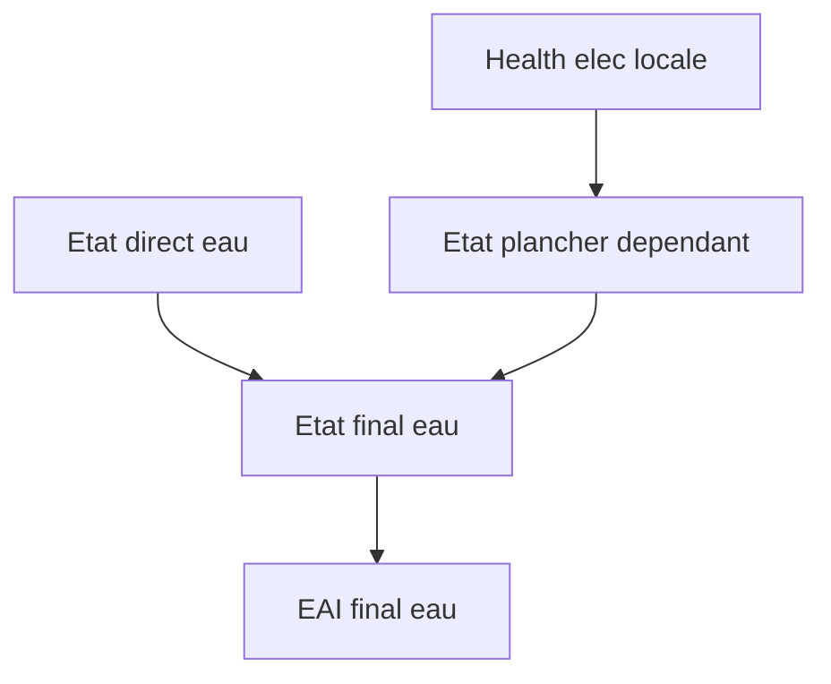

# Note simplifiee - Backend calculatoire cyclone

## 1. Objet
Cette note explique le fonctionnement du backend Python pour l'analyse des risques cycloniques, avec:
- infrastructures electriques,
- infrastructures eau potable et eaux usees,
- propagation des dysfonctionnements electricite -> eau.

Le backend actuel est un moteur fallback deterministic (pas encore CLIMADA complet), mais il implemente deja les regles metier demandees.

## 2. Chaine de calcul


## 3. Categories d'exposition
La normalisation est faite dans `backend/app/risk_engine/exposure_ingest.py`:
- `habitation`
- `ouvrage_eau`
- `ouvrage_electrique`

L'utilisateur peut:
- fournir `exposure_category_field` dans son fichier,
- ou definir `default_exposure_category` (upload et dessin).

## 4. Regle d'etat (4 niveaux)
Dans `backend/app/risk_engine/impact_runner.py`, chaque composant recoit un ratio de dommage puis un etat:
- `S0` operationnel: dommage < 0.05
- `S1` degrade: 0.05 <= dommage < 0.15
- `S2` critique: 0.15 <= dommage < 0.35
- `S3` hors service: dommage >= 0.35

Interet des 4 etats:
- meilleure finesse de pilotage qu'un binaire operationnel/hors service,
- priorisation des actions (maintenance, renforcement, secours),
- meilleure lecture de la degradation progressive d'un reseau.

## 5. Health des composants
La sante d'un composant est calculee avec:

`health = 1 - (0.3*L_S1 + 0.7*L_S2 + 1.0*L_S3) / L_total`

Ou:
- `L_total`: poids total du composant (longueur pour reseaux lineaires, sinon poids unitaire),
- `L_S1`, `L_S2`, `L_S3`: part en etat degrade/critique/hors service.

Lecture:
- `health = 1`: composant pleinement operationnel,
- `health = 0`: composant totalement hors service.

## 6. Propagation elec -> eau
Hypothese prudente actuelle:
- tous les actifs d'eau sont consideres dependants de l'electricite.

Regle:
1. calcul de la sante electrique par territoire,
2. si la sante electrique locale est faible, on impose un etat plancher aux ouvrages eau:
   - health elec < 0.75 -> au moins `S1`
   - health elec < 0.55 -> au moins `S2`
   - health elec < 0.35 -> `S3`
3. l'EAI eau est augmente en consequence.



## 7. Extrait de code cle
```python
direct_state = _state_from_damage_ratio(direct_damage)
dependency_state = _dependency_state_from_elec_health(elec_health)
if STATE_ORDER[dependency_state] > STATE_ORDER[direct_state]:
    final_state = dependency_state
final_damage = max(direct_damage, STATE_DAMAGE_FLOOR[dependency_state])
eai_ratio = final_damage * ANNUALIZATION_FACTOR[hazard]
eai_value = exposure_value * eai_ratio
```

## 8. Resultats renvoyes par l'API
Le JSON final contient:
- `territory_results` (exposition, EAI STORM, EAI STORM_CMCC, index de risque),
- `portfolio_results` (KPIs globaux),
- `portfolio_results.component_health` avec `L_total`, `L_S1`, `L_S2`, `L_S3`, `health`,
- `portfolio_results.interdependency` avec hypothese de dependance.

## 9. Jeux de donnees Guadeloupe integres
- Resultat de reference complet: `web/data/guadeloupe-complete-analysis.json`
- Cartes de vent moyen: `web/data/guadeloupe-wind-maps.json`

Sources STORM completes (a citer dans la restitution GitHub):
- https://data.4tu.nl/articles/dataset/STORM_IBTrACS_present_climate_synthetic_tropical_cyclone_tracks/12706085
- https://data.4tu.nl/datasets/98900e17-8e01-4d70-b3b6-ca1a1da2f194/2
