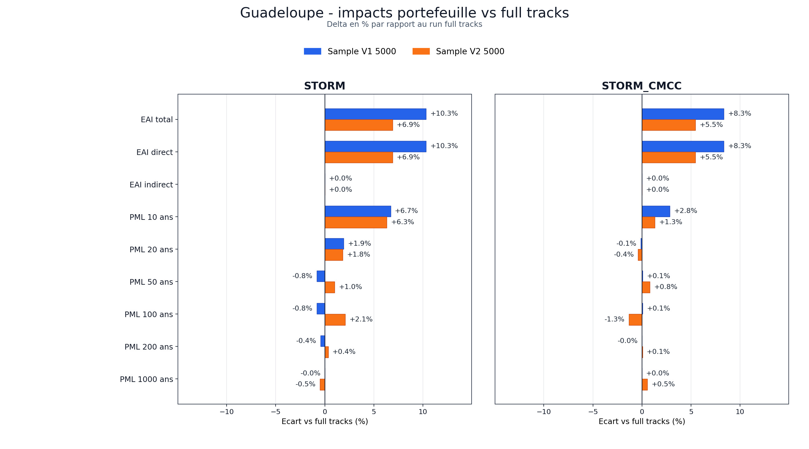
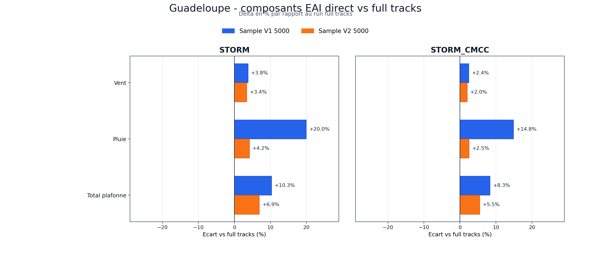
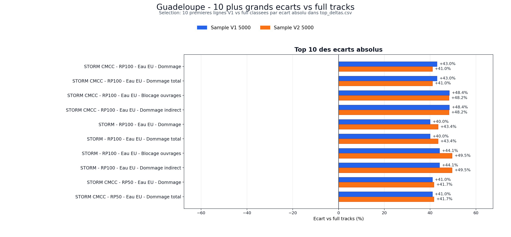

# Analyse comparative Guadeloupe: full tracks vs samples V1/V2 5000

Generation: `2026-07-23T14:17:49Z`

## Synthese

Cette analyse compare le run de reference full tracks `20260711_071243` aux runs sample V1 `20260711_074032` et sample V2 `20260720_134606`. Les deltas `V1 - full` et `V2 - full` quantifient l'ecart de chaque echantillon 5000 tracks a la population complete; `V2 - V1` isole l'effet de methode entre deux echantillons de meme taille.

## Controle de comparabilite

| Scope | Alea | Service | Metrique | Full | V1 | V2 | Statut |
| --- | --- | --- | --- | --- | --- | --- | --- |
| complete_analysis | all |  | asset_results_count | 110 315 | 110 315 | 110 315 | V1 OK, V2 OK |
| complete_analysis | all |  | territory_results_count | 18 | 18 | 18 | V1 OK, V2 OK |
| exposure_summary | all |  | asset_count_original | 110 315 | 110 315 | 110 315 | V1 OK, V2 OK |
| exposure_summary | all |  | asset_count_points | 290 545 | 290 545 | 290 545 | V1 OK, V2 OK |
| exposure_summary | all |  | total_exposure_eur | 10 958.92 M EUR | 10 958.92 M EUR | 10 958.92 M EUR | V1 OK, V2 OK |
| network_states.canonical_service_unit_counts | storm | eau_aep | total_units | 199 | 199 | 199 | V1 OK, V2 OK |
| network_states.canonical_service_unit_counts | storm | eau_eu | total_units | 270 | 270 | 270 | V1 OK, V2 OK |
| network_states.canonical_service_unit_counts | storm | elec | total_units | 40 | 40 | 40 | V1 OK, V2 OK |
| network_states.canonical_service_unit_counts | storm_cmcc | eau_aep | total_units | 199 | 199 | 199 | V1 OK, V2 OK |
| network_states.canonical_service_unit_counts | storm_cmcc | eau_eu | total_units | 270 | 270 | 270 | V1 OK, V2 OK |
| network_states.canonical_service_unit_counts | storm_cmcc | elec | total_units | 40 | 40 | 40 | V1 OK, V2 OK |

Les controles d'exposition et d'unites reseau critiques sont identiques entre les runs compares.

## Impacts portefeuille

| Alea | Metrique | Full | V1 | V1-Full | V1-Full % | V2 | V2-Full | V2-Full % | V2-V1 | V2-V1 % |
| --- | --- | --- | --- | --- | --- | --- | --- | --- | --- | --- |
| storm | eai_eur | 59.45 M EUR | 65.59 M EUR | 6.14 M EUR | +10.32% | 63.56 M EUR | 4.10 M EUR | +6.90% | -2.03 M EUR | -3.10% |
| storm | eai_direct_eur | 59.45 M EUR | 65.59 M EUR | 6.14 M EUR | +10.32% | 63.56 M EUR | 4.10 M EUR | +6.90% | -2.03 M EUR | -3.10% |
| storm | eai_indirect_eur | 0.00 M EUR | 0.00 M EUR | 0.00 M EUR | - | 0.00 M EUR | 0.00 M EUR | - | 0.00 M EUR | - |
| storm | percentile_99_loss_eur | 558.18 M EUR | 555.11 M EUR | -3.07 M EUR | -0.55% | 564.39 M EUR | 6.21 M EUR | +1.11% | 9.28 M EUR | +1.67% |
| storm | pml_100_eur | 737.60 M EUR | 731.50 M EUR | -6.11 M EUR | -0.83% | 753.04 M EUR | 15.44 M EUR | +2.09% | 21.55 M EUR | +2.95% |
| storm | pml_1000_eur | 1 061.33 M EUR | 1 061.33 M EUR | -0.00 M EUR | -0.00% | 1 055.92 M EUR | -5.42 M EUR | -0.51% | -5.42 M EUR | -0.51% |
| storm_cmcc | eai_eur | 59.17 M EUR | 64.10 M EUR | 4.93 M EUR | +8.34% | 62.40 M EUR | 3.23 M EUR | +5.46% | -1.70 M EUR | -2.65% |
| storm_cmcc | eai_direct_eur | 59.17 M EUR | 64.10 M EUR | 4.93 M EUR | +8.34% | 62.40 M EUR | 3.23 M EUR | +5.46% | -1.70 M EUR | -2.65% |
| storm_cmcc | eai_indirect_eur | 0.00 M EUR | 0.00 M EUR | 0.00 M EUR | - | 0.00 M EUR | 0.00 M EUR | - | 0.00 M EUR | - |
| storm_cmcc | percentile_99_loss_eur | 567.32 M EUR | 567.85 M EUR | 0.53 M EUR | +0.09% | 569.63 M EUR | 2.30 M EUR | +0.41% | 1.78 M EUR | +0.31% |
| storm_cmcc | pml_100_eur | 749.78 M EUR | 750.27 M EUR | 0.49 M EUR | +0.07% | 739.76 M EUR | -10.03 M EUR | -1.34% | -10.52 M EUR | -1.40% |
| storm_cmcc | pml_1000_eur | 1 055.13 M EUR | 1 055.13 M EUR | 0.00 M EUR | +0.00% | 1 060.89 M EUR | 5.77 M EUR | +0.55% | 5.77 M EUR | +0.55% |

## Composants EAI direct

| Alea | Composant | Full | V1 | V1-Full | V1-Full % | V2 | V2-Full | V2-Full % | V2-V1 | V2-V1 % |
| --- | --- | --- | --- | --- | --- | --- | --- | --- | --- | --- |
| storm | wind | 48.28 M EUR | 50.10 M EUR | 1.82 M EUR | +3.77% | 49.93 M EUR | 1.65 M EUR | +3.42% | -0.17 M EUR | -0.34% |
| storm | rain | 11.17 M EUR | 13.40 M EUR | 2.23 M EUR | +19.95% | 11.64 M EUR | 0.46 M EUR | +4.15% | -1.77 M EUR | -13.17% |
| storm | surge | 0.00 M EUR | 2.09 M EUR | 2.09 M EUR | +1078274.34% | 1.99 M EUR | 1.99 M EUR | +1027739.34% | -0.10 M EUR | -4.69% |
| storm | combined_capped | 59.45 M EUR | 65.59 M EUR | 6.14 M EUR | +10.32% | 63.56 M EUR | 4.10 M EUR | +6.90% | -2.03 M EUR | -3.10% |
| storm_cmcc | wind | 47.58 M EUR | 48.75 M EUR | 1.17 M EUR | +2.45% | 48.52 M EUR | 0.94 M EUR | +1.98% | -0.22 M EUR | -0.46% |
| storm_cmcc | rain | 11.59 M EUR | 13.31 M EUR | 1.72 M EUR | +14.83% | 11.88 M EUR | 0.29 M EUR | +2.52% | -1.43 M EUR | -10.72% |
| storm_cmcc | surge | 0.00 M EUR | 2.05 M EUR | 2.05 M EUR | +1051257.23% | 2.00 M EUR | 2.00 M EUR | +1025802.83% | -0.05 M EUR | -2.42% |
| storm_cmcc | combined_capped | 59.17 M EUR | 64.10 M EUR | 4.93 M EUR | +8.34% | 62.40 M EUR | 3.23 M EUR | +5.46% | -1.70 M EUR | -2.65% |

## Population et reseaux

| Alea | Scenario | Metrique | Full | V1 | V1-Full | V1-Full % | V2 | V2-Full | V2-Full % | V2-V1 | V2-V1 % |
| --- | --- | --- | --- | --- | --- | --- | --- | --- | --- | --- | --- |
| storm | rp50 | total_population_affected_any_network | 394 927 | 394 927 | 0 | +0.00% | 394 927 | 0 | +0.00% | 0 | +0.00% |
| storm | rp50 | total_without_eau_aep | 386 107 | 386 107 | 0 | +0.00% | 386 107 | 0 | +0.00% | 0 | +0.00% |
| storm | rp50 | total_with_degraded_eau_eu | 394 927 | 394 927 | 0 | +0.00% | 394 927 | 0 | +0.00% | 0 | +0.00% |
| storm | rp100 | total_population_affected_any_network | 394 927 | 394 927 | 0 | +0.00% | 394 927 | 0 | +0.00% | 0 | +0.00% |
| storm | rp100 | total_without_eau_aep | 386 107 | 386 107 | 0 | +0.00% | 386 107 | 0 | +0.00% | 0 | +0.00% |
| storm | rp100 | total_with_degraded_eau_eu | 394 927 | 394 927 | 0 | +0.00% | 394 927 | 0 | +0.00% | 0 | +0.00% |
| storm | rp1000 | total_population_affected_any_network | 401 747 | 401 747 | 0 | +0.00% | 401 747 | 0 | +0.00% | 0 | +0.00% |
| storm | rp1000 | total_without_eau_aep | 51 718 | 51 718 | 0 | +0.00% | 51 718 | 0 | +0.00% | 0 | +0.00% |
| storm | rp1000 | total_with_degraded_eau_eu | 394 927 | 394 927 | 0 | +0.00% | 394 927 | 0 | +0.00% | 0 | +0.00% |
| storm_cmcc | rp50 | total_population_affected_any_network | 386 107 | 386 107 | 0 | +0.00% | 386 107 | 0 | +0.00% | 0 | +0.00% |
| storm_cmcc | rp50 | total_without_eau_aep | 386 107 | 386 107 | 0 | +0.00% | 386 107 | 0 | +0.00% | 0 | +0.00% |
| storm_cmcc | rp50 | total_with_degraded_eau_eu | 2 669 | 2 669 | 0 | +0.00% | 2 669 | 0 | +0.00% | 0 | +0.00% |
| storm_cmcc | rp100 | total_population_affected_any_network | 386 107 | 386 107 | 0 | +0.00% | 386 107 | 0 | +0.00% | 0 | +0.00% |
| storm_cmcc | rp100 | total_without_eau_aep | 386 107 | 386 107 | 0 | +0.00% | 386 107 | 0 | +0.00% | 0 | +0.00% |
| storm_cmcc | rp100 | total_with_degraded_eau_eu | 191 329 | 191 329 | 0 | +0.00% | 154 227 | -37 102 | -19.39% | -37 102 | -19.39% |
| storm_cmcc | rp1000 | total_population_affected_any_network | 401 747 | 401 747 | 0 | +0.00% | 401 747 | 0 | +0.00% | 0 | +0.00% |
| storm_cmcc | rp1000 | total_without_eau_aep | 0 | 0 | 0 | - | 0 | 0 | - | 0 | - |
| storm_cmcc | rp1000 | total_with_degraded_eau_eu | 394 927 | 394 927 | 0 | +0.00% | 394 927 | 0 | +0.00% | 0 | +0.00% |

## Plus grands ecarts

| Comparaison | Base | Rang | Categorie | Alea | Scenario | Objet | Metrique | Reference | Compare | Delta | Delta % |
| --- | --- | --- | --- | --- | --- | --- | --- | --- | --- | --- | --- |
| v1_vs_full | abs | 1 | network_damage | storm_cmcc | rp100 | eau_eu | damage_eur | 93.29 M EUR | 133.41 M EUR | 40.11 M EUR | +43.00% |
| v1_vs_full | abs | 2 | network_damage | storm_cmcc | rp100 | eau_eu | total_damage_eur | 93.29 M EUR | 133.41 M EUR | 40.11 M EUR | +43.00% |
| v1_vs_full | abs | 3 | network_damage | storm_cmcc | rp100 | eau_eu | blocking_ouvrage_eur | 77.73 M EUR | 115.35 M EUR | 37.62 M EUR | +48.40% |
| v1_vs_full | abs | 4 | network_damage | storm_cmcc | rp100 | eau_eu | indirect_damage_eur | 77.73 M EUR | 115.35 M EUR | 37.62 M EUR | +48.40% |
| v1_vs_full | abs | 5 | network_damage | storm | rp100 | eau_eu | damage_eur | 92.27 M EUR | 129.15 M EUR | 36.88 M EUR | +39.97% |
| v1_vs_full | abs | 6 | network_damage | storm | rp100 | eau_eu | total_damage_eur | 92.27 M EUR | 129.15 M EUR | 36.88 M EUR | +39.97% |
| v1_vs_full | abs | 7 | network_damage | storm | rp100 | eau_eu | blocking_ouvrage_eur | 77.73 M EUR | 112.00 M EUR | 34.26 M EUR | +44.08% |
| v1_vs_full | abs | 8 | network_damage | storm | rp100 | eau_eu | indirect_damage_eur | 77.73 M EUR | 112.00 M EUR | 34.26 M EUR | +44.08% |
| v1_vs_full | abs | 9 | network_damage | storm_cmcc | rp50 | eau_eu | damage_eur | 82.40 M EUR | 116.17 M EUR | 33.76 M EUR | +40.97% |
| v1_vs_full | abs | 10 | network_damage | storm_cmcc | rp50 | eau_eu | total_damage_eur | 82.40 M EUR | 116.17 M EUR | 33.76 M EUR | +40.97% |
| v1_vs_full | pct | 1 | network_damage | storm | rp10 | eau_eu | blocking_ouvrage_eur | 24.62 M EUR | 49.01 M EUR | 24.40 M EUR | +99.10% |
| v1_vs_full | pct | 2 | network_damage | storm | rp10 | eau_eu | indirect_damage_eur | 24.62 M EUR | 49.01 M EUR | 24.40 M EUR | +99.10% |
| v1_vs_full | pct | 3 | network_damage | storm_cmcc | rp10 | eau_eu | blocking_ouvrage_eur | 23.78 M EUR | 45.62 M EUR | 21.84 M EUR | +91.82% |
| v1_vs_full | pct | 4 | network_damage | storm_cmcc | rp10 | eau_eu | indirect_damage_eur | 23.78 M EUR | 45.62 M EUR | 21.84 M EUR | +91.82% |
| v1_vs_full | pct | 5 | network_damage | storm | rp10 | eau_eu | damage_eur | 27.94 M EUR | 53.19 M EUR | 25.25 M EUR | +90.37% |
| v1_vs_full | pct | 6 | network_damage | storm | rp10 | eau_eu | total_damage_eur | 27.94 M EUR | 53.19 M EUR | 25.25 M EUR | +90.37% |
| v1_vs_full | pct | 7 | scenario_component_damage | storm | rp10 | eau_eu | damage_component_eur | 24.41 M EUR | 45.34 M EUR | 20.93 M EUR | +85.75% |
| v1_vs_full | pct | 8 | network_damage | storm_cmcc | rp10 | eau_eu | damage_eur | 26.87 M EUR | 49.17 M EUR | 22.30 M EUR | +83.00% |
| v1_vs_full | pct | 9 | network_damage | storm_cmcc | rp10 | eau_eu | total_damage_eur | 26.87 M EUR | 49.17 M EUR | 22.30 M EUR | +83.00% |
| v1_vs_full | pct | 10 | scenario_component_damage | storm | rp10 | eau_eu | damage_component_eur | 3.53 M EUR | 6.39 M EUR | 2.86 M EUR | +80.87% |
| v2_vs_full | abs | 1 | network_damage | storm | rp100 | eau_eu | damage_eur | 92.27 M EUR | 132.33 M EUR | 40.07 M EUR | +43.42% |
| v2_vs_full | abs | 2 | network_damage | storm | rp100 | eau_eu | total_damage_eur | 92.27 M EUR | 132.33 M EUR | 40.07 M EUR | +43.42% |
| v2_vs_full | abs | 3 | network_damage | storm | rp100 | eau_eu | blocking_ouvrage_eur | 77.73 M EUR | 116.24 M EUR | 38.51 M EUR | +49.54% |
| v2_vs_full | abs | 4 | network_damage | storm | rp100 | eau_eu | indirect_damage_eur | 77.73 M EUR | 116.24 M EUR | 38.51 M EUR | +49.54% |
| v2_vs_full | abs | 5 | network_damage | storm_cmcc | rp100 | eau_eu | damage_eur | 93.29 M EUR | 131.51 M EUR | 38.22 M EUR | +40.96% |
| v2_vs_full | abs | 6 | network_damage | storm_cmcc | rp100 | eau_eu | total_damage_eur | 93.29 M EUR | 131.51 M EUR | 38.22 M EUR | +40.96% |
| v2_vs_full | abs | 7 | network_damage | storm_cmcc | rp100 | eau_eu | blocking_ouvrage_eur | 77.73 M EUR | 115.18 M EUR | 37.45 M EUR | +48.18% |
| v2_vs_full | abs | 8 | network_damage | storm_cmcc | rp100 | eau_eu | indirect_damage_eur | 77.73 M EUR | 115.18 M EUR | 37.45 M EUR | +48.18% |
| v2_vs_full | abs | 9 | network_damage | storm_cmcc | rp50 | eau_eu | damage_eur | 82.40 M EUR | 116.74 M EUR | 34.33 M EUR | +41.67% |
| v2_vs_full | abs | 10 | network_damage | storm_cmcc | rp50 | eau_eu | total_damage_eur | 82.40 M EUR | 116.74 M EUR | 34.33 M EUR | +41.67% |
| v2_vs_full | pct | 1 | network_damage | storm | rp10 | eau_eu | blocking_ouvrage_eur | 24.62 M EUR | 48.96 M EUR | 24.35 M EUR | +98.90% |
| v2_vs_full | pct | 2 | network_damage | storm | rp10 | eau_eu | indirect_damage_eur | 24.62 M EUR | 48.96 M EUR | 24.35 M EUR | +98.90% |
| v2_vs_full | pct | 3 | network_damage | storm_cmcc | rp10 | eau_eu | blocking_ouvrage_eur | 23.78 M EUR | 45.25 M EUR | 21.47 M EUR | +90.30% |
| v2_vs_full | pct | 4 | network_damage | storm_cmcc | rp10 | eau_eu | indirect_damage_eur | 23.78 M EUR | 45.25 M EUR | 21.47 M EUR | +90.30% |
| v2_vs_full | pct | 5 | network_damage | storm | rp10 | eau_eu | damage_eur | 27.94 M EUR | 52.71 M EUR | 24.77 M EUR | +88.65% |
| v2_vs_full | pct | 6 | network_damage | storm | rp10 | eau_eu | total_damage_eur | 27.94 M EUR | 52.71 M EUR | 24.77 M EUR | +88.65% |
| v2_vs_full | pct | 7 | scenario_component_damage | storm | rp10 | eau_eu | damage_component_eur | 24.41 M EUR | 45.10 M EUR | 20.69 M EUR | +84.78% |
| v2_vs_full | pct | 8 | network_damage | storm_cmcc | rp10 | eau_eu | damage_eur | 26.87 M EUR | 48.46 M EUR | 21.59 M EUR | +80.37% |
| v2_vs_full | pct | 9 | network_damage | storm_cmcc | rp10 | eau_eu | total_damage_eur | 26.87 M EUR | 48.46 M EUR | 21.59 M EUR | +80.37% |
| v2_vs_full | pct | 10 | scenario_component_damage | storm_cmcc | rp10 | eau_eu | damage_component_eur | 23.20 M EUR | 40.74 M EUR | 17.54 M EUR | +75.62% |
| v2_vs_v1 | abs | 1 | portfolio | storm | all |  | pml_100_eur | 731.50 M EUR | 753.04 M EUR | 21.55 M EUR | +2.95% |
| v2_vs_v1 | abs | 2 | scenario_summary | storm | all |  | rp100_eur | 731.50 M EUR | 753.04 M EUR | 21.55 M EUR | +2.95% |
| v2_vs_v1 | abs | 3 | portfolio | storm_cmcc | all |  | pml_100_eur | 750.27 M EUR | 739.76 M EUR | -10.52 M EUR | -1.40% |
| v2_vs_v1 | abs | 4 | scenario_summary | storm_cmcc | all |  | rp100_eur | 750.27 M EUR | 739.76 M EUR | -10.52 M EUR | -1.40% |
| v2_vs_v1 | abs | 5 | portfolio | storm | all |  | pml_50_eur | 565.74 M EUR | 575.98 M EUR | 10.24 M EUR | +1.81% |
| v2_vs_v1 | abs | 6 | scenario_summary | storm | all |  | rp50_eur | 565.74 M EUR | 575.98 M EUR | 10.24 M EUR | +1.81% |
| v2_vs_v1 | abs | 7 | portfolio | storm | all |  | percentile_99_loss_eur | 555.11 M EUR | 564.39 M EUR | 9.28 M EUR | +1.67% |
| v2_vs_v1 | abs | 8 | portfolio_component | storm_cmcc | all | wind | p99_component_loss_eur | 519.90 M EUR | 528.26 M EUR | 8.36 M EUR | +1.61% |
| v2_vs_v1 | abs | 9 | portfolio_component | storm | all | wind | p99_component_loss_eur | 504.13 M EUR | 511.30 M EUR | 7.17 M EUR | +1.42% |
| v2_vs_v1 | abs | 10 | network_damage | storm | rp1000 | eau_aep | direct_damage_eur | 62.36 M EUR | 55.37 M EUR | -6.99 M EUR | -11.20% |
| v2_vs_v1 | pct | 1 | network_state_units | storm_cmcc | rp100 | eau_eu | S1 | 3 | 2 | -1 | -33.33% |
| v2_vs_v1 | pct | 2 | population | storm_cmcc | rp100 |  | total_with_degraded_eau_eu | 191 329 | 154 227 | -37 102 | -19.39% |
| v2_vs_v1 | pct | 3 | population_state_count | storm_cmcc | rp100 | eau_eu | population_S1 | 191 329 | 154 227 | -37 102 | -19.39% |
| v2_vs_v1 | pct | 4 | population_state_count | storm_cmcc | rp100 | eau_eu | population_S0 | 217 273 | 254 375 | 37 102 | +17.08% |
| v2_vs_v1 | pct | 5 | portfolio_component | storm | all | rain | direct_eai_component_eur | 13.40 M EUR | 11.64 M EUR | -1.77 M EUR | -13.17% |
| v2_vs_v1 | pct | 6 | scenario_component_damage | storm | rp100 | elec_hta_aerien | damage_component_eur | 1.13 M EUR | 1.27 M EUR | 0.14 M EUR | +12.22% |
| v2_vs_v1 | pct | 7 | network_damage | storm | rp100 | elec_hta_aerien | damage_eur | 1.28 M EUR | 1.43 M EUR | 0.15 M EUR | +11.65% |
| v2_vs_v1 | pct | 8 | network_damage | storm | rp100 | elec_hta_aerien | direct_damage_eur | 1.28 M EUR | 1.43 M EUR | 0.15 M EUR | +11.65% |
| v2_vs_v1 | pct | 9 | network_damage | storm | rp100 | elec_hta_aerien | total_damage_eur | 1.28 M EUR | 1.43 M EUR | 0.15 M EUR | +11.65% |
| v2_vs_v1 | pct | 10 | network_damage | storm | rp1000 | eau_aep | direct_damage_eur | 62.36 M EUR | 55.37 M EUR | -6.99 M EUR | -11.20% |

## Echantillons 5000

| Sample | Provider | Methode | Score kind | Tracks | Population tracks | Seed | Score | Poids min | Poids max | Poids moyen |
| --- | --- | --- | --- | --- | --- | --- | --- | --- | --- | --- |
| sample_v1 | storm | seeded_stratified_damage_with_physical_balancing |  | 5000 | 21322 | 240903 | 0.89 | 1.00 | 10.29 | 4.26 |
| sample_v1 | storm_cmcc | seeded_stratified_damage_with_physical_balancing |  | 5000 | 22262 | 258003 | 0.90 | 1.00 | 10.86 | 4.45 |
| sample_v2 | storm | seeded_stratified_intensity_distance_score_mass | intensity_distance_weighted_mps | 5000 | 21322 | 240716 | 2.60 | 1.00 | 13.67 | 4.26 |
| sample_v2 | storm_cmcc | seeded_stratified_intensity_distance_score_mass | intensity_distance_weighted_mps | 5000 | 22262 | 257907 | 2.70 | 1.00 | 13.67 | 4.45 |

## Metriques manquantes

Aucune metrique comparable attendue n'est absente d'un des runs compares.

## Graphes tornado

## Fichiers produits

- `metrics_comparison.csv`: toutes les metriques comparees.
- `top_deltas.csv`: plus grands ecarts absolus et relatifs.
- `sample_manifest_summary.csv`: structure des echantillons V1/V2.
- `comparison-data.json`: payload structure incluant les colonnes V2.
- `guadeloupe_track_sampling_tornado_impacts_portefeuille.png`: tornado des impacts portefeuille.
- `guadeloupe_track_sampling_tornado_composants_eai_direct.png`: tornado des composants EAI direct.
- `guadeloupe_track_sampling_tornado_top_10_ecarts.png`: tornado des 10 plus grands ecarts.
